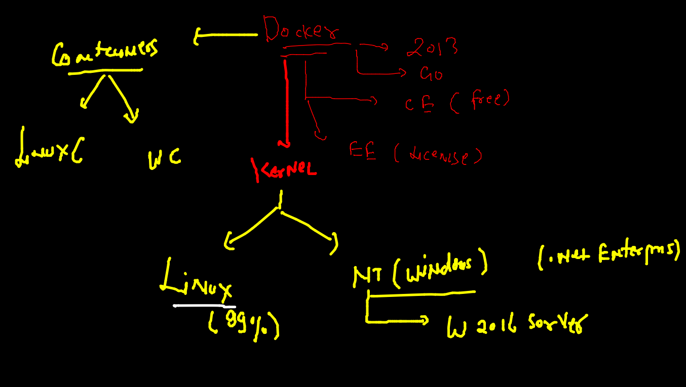
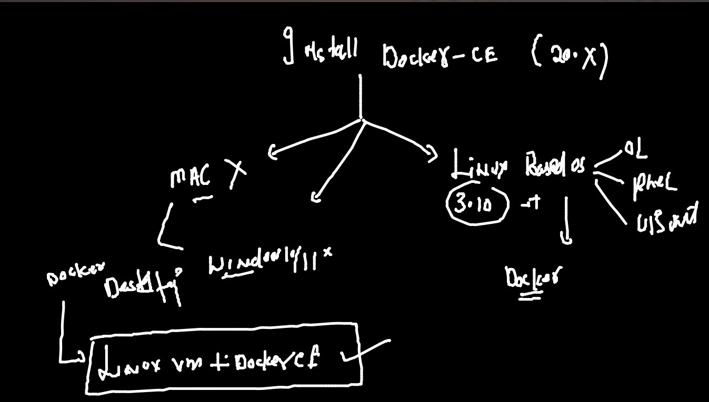

##  Training Plan 


### apps to test and deploy 


## problems 

### app libs comptability 


### intro to hypervisors {virtaulization}


### vm problem 1 


### vm problem 2 


## WElcome to CRE (Container runtime Engines)


### CRE 


### CRE vs hypervisor 


### Docker as CRE 



### Installing docker 



### Docker Desktop for MAC 

[INstalllink](https://hub.docker.com/editions/community/docker-ce-desktop-mac)

### Docker Desktop for windows 10 / 11 

### checking after installation 

```
docker  -v 
Docker version 20.10.8, build 3967b7d
 fire@ashutoshhs-MacBook-Air  ~  docker  version 
Client:
 Cloud integration: 1.0.17
 Version:           20.10.8
 API version:       1.41
 Go version:        go1.16.6
 Git commit:        3967b7d
 Built:             Fri Jul 30 19:55:20 2021
 OS/Arch:           darwin/amd64
 Context:           default
 Experimental:      true

Server: Docker Engine - Community
 Engine:
  Version:          20.10.8
  API version:      1.41 (minimum version 1.12)
  Go version:       go1.16.6
  Git commit:       75249d8
  Built:            Fri Jul 30 19:52:31 2021
  OS/Arch:          linux/amd64

```

### Install in Linux Host : centos / rhel / OL 

```
 yum  install docker -y
Loaded plugins: extras_suggestions, langpacks, priorities, update-motd
Resolving Dependencies
--> Running transaction check
---> Package docker.x86_64 0:20.10.7-5.amzn2 will be installed
--> Processing Dependency: runc >= 1.0.0 for package: docker-20.10.7-5.amzn2.x86_64
--> Processing Dependency: libcgroup >= 0.40.rc1-5.15 for package: docker-20.10.7-5.a
mzn2.x86_64
--> Processing Dependency: containerd >= 1.3.2 for package: docker-20.10.7-5.amzn2.x8
6_64
--> Processing Dependency: pigz for package: docker-20.10.7-5.amzn2.x86_64
--> Running transaction check
---> Package containerd.x86_64 0:1.4.6-7.amzn2 will be installed
---> Package libcgroup.x86_64 0:0.41-21.amzn2 will be installed
---> Package pigz.x86_64 0:2.3.4-1.amzn2.0.1 will be installed
---> Package runc.x86_64 0:1.0.0-2.amzn2 will be installed
--> Finished Dependency Resolution

```


### Starting docker engine service 

```
 systemctl enable --now docker 
Created symlink from /etc/systemd/system/multi-user.target.wants/docker.service to /u
sr/lib/systemd/system/docker.service.
[root@ip-172-31-93-168 ~]# systemctl status docker 
● docker.service - Docker Application Container Engine
   Loaded: loaded (/usr/lib/systemd/system/docker.service; enabled; vendor preset: di
sabled)
   Active: active (running) since Mon 2021-12-06 06:11:53 UTC; 9s ago
     Docs: https://docs.docker.com
  Process: 3232 ExecStartPre=/usr/libexec/docker/docker-setup-runtimes.sh (code=exite
d, status=0/SUCCESS)
  Process: 3215 ExecStartPre=/bin/mkdir
  
 ```
  
 ### adding non root user in linux Host 
 
 ```
  5  useradd  test 
    6  usermod -aG docker test 
    7  echo "OracleDocker088"  |  passwd test --stind 
    
 ```
 
 
