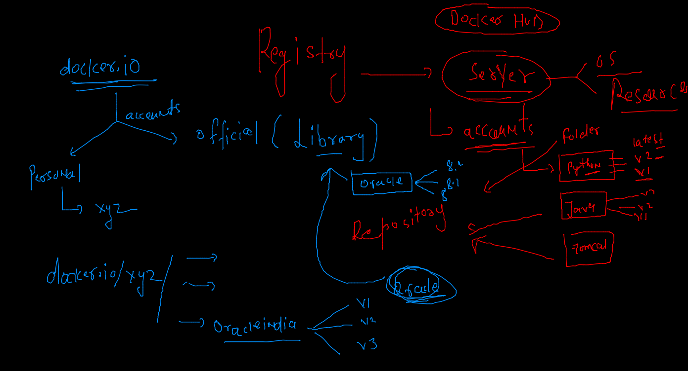

# Training Plan 


## Revision 


### Namespaces and cgroups 


### apply cgroups for RAM and CPU consumption 

```
1005  docker  run -itd --name ashuc2 --memory 100m alpine ping fb.com 
 1006  history 
 1007  docker stats
 1008  hisor
 1009  history 
 1010  docker  run -itd --name ashu23 --cpu-shares=30  --memory 100m alpine ping fb.com 
 
```

### DOcker registry 


### Docker hub registry 



## image pushing to docker hub from docker host 

### tag image as per docker hub standard 

```
docker tag  a0f1dd29f90b  docker.io/dockerashu/oracleindia:dec72021 
=== OR 
docker tag  ashualp:pycodev1  docker.io/dockerashu/oracleindia:dec72021 

```

### login to docker hub account from Docker host 

```
 docker  login 
Login with your Docker ID to push and pull images from Docker Hub. If you don't have a Docker ID, head over to https://hub.docker.com to create one.
Username: dockerashu
Password: 
WARNING! Your password will be stored unencrypted in /home/test/.docker/config.json.
Configure a credential helper to remove this warning. See
https://docs.docker.com/engine/reference/commandline/login/#credentials-store

Login Succeeded

```

### pushing image to hub 

```
docker push dockerashu/oracleindia:dec72021
The push refers to repository [docker.io/dockerashu/oracleindia]
1cbfa46102dd: Pushed 
b29741d18a4a: Pushed 
2898e0f03f21: Pushed 
8d3ac3489996: Mounted from sunilsaini/oracleindia

```

### docker logout 

```
 docker logout 
Removing login credentials for https://index.docker.io/v1/

```


