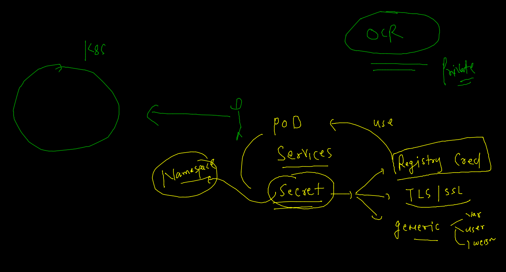
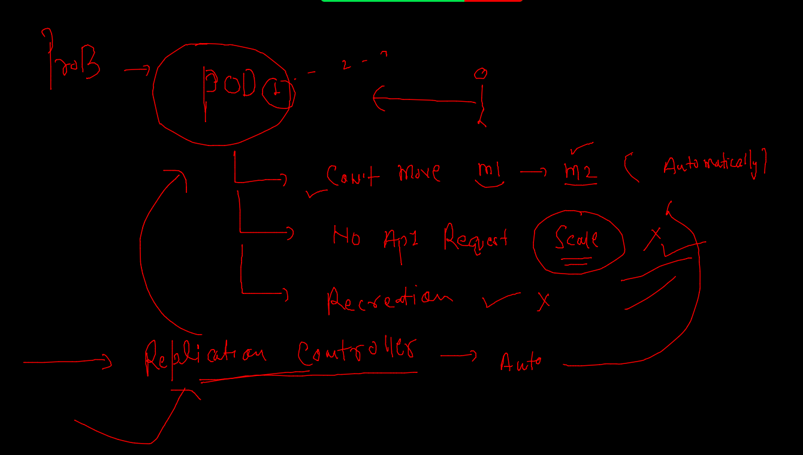
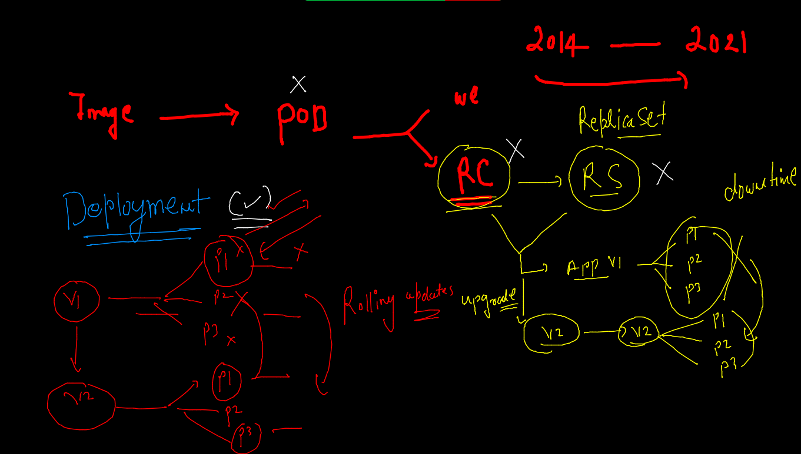
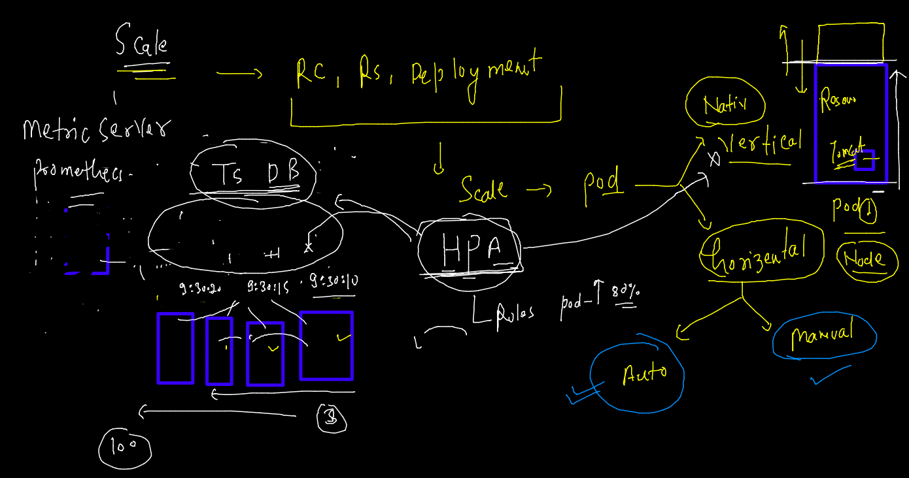

# Training Plan 


## Revision 


## Intro to secret resources in k8s 



### creating secret in our namespace 

```
kubectl config get-contexts 
CURRENT   NAME                          CLUSTER      AUTHINFO           NAMESPACE
*         kubernetes-admin@kubernetes   kubernetes   kubernetes-admin   ashu-space
 fire@ashutoshhs-MacBook-Air  ~/Desktop/k8sapps  
 fire@ashutoshhs-MacBook-Air  ~/Desktop/k8sapps  kubectl  get secret 
NAME                  TYPE                                  DATA   AGE
default-token-rgxvk   kubernetes.io/service-account-token   3      22h
 fire@ashutoshhs-MacBook-Air  ~/Desktop/k8sapps  
 fire@ashutoshhs-MacBook-Air  ~/Desktop/k8sapps  kubectl create secret 
Create a secret using specified subcommand.

Available Commands:
  docker-registry Create a secret for use with a Docker registry
  generic         Create a secret from a local file, directory, or literal value
  tls             Create a TLS secret


```

### ocr secret in k8s 

```
kubectl create secret  docker-registry  ashuocr       --docker-server=phx.ocir.io   --docker-username="tg8judkl/techbyme@gmail.com" --docker-password="M3drv7P#ejvX"
```

### apply nw changes 

```
kubectl replace -f ocr.yaml --force 
pod "ashupodx1" deleted
pod/ashupodx1 replaced
 fire@ashutoshhs-MacBook-Air  ~/Desktop/k8sapps  kubectl  get  pod
NAME        READY   STATUS    RESTARTS   AGE
ashupodx1   1/1     Running   0          10s

```

## ReplicationController 




### RC YAML 

```
apiVersion: v1
kind: ReplicationController
metadata:
 name: ashurc-1 
spec:
 replicas: 1 # number of pod we want 
 template: # rc will be using template to create PODs 
  metadata:
   labels: # label of pod 
    x: helloashutoshh1
  spec:
   containers:
   - image: dockerashu/oraclenode:v1
     name: ashuc1 
     ports:
     - containerPort: 3000


```

### deploy 

```
kubectl apply -f  ashurc1.yaml 
replicationcontroller/ashurc-1 created
 fire@ashutoshhs-MacBook-Air  ~/Desktop/k8sapps  kubectl  get  rc
NAME       DESIRED   CURRENT   READY   AGE
ashurc-1   1         1         1       5s
 fire@ashutoshhs-MacBook-Air  ~/Desktop/k8sapps  kubectl  get  po              
NAME             READY   STATUS    RESTARTS   AGE
ashurc-1-l5jdg   1/1     Running   0          22s
 fire@ashutoshhs-MacBook-Air  ~/Desktop/k8sapps  kubectl  get  po --show-labels
NAME             READY   STATUS    RESTARTS   AGE   LABELS
ashurc-1-l5jdg   1/1     Running   0          34s   x=helloashutoshh1

```

### creating service using expose method 

```
kubectl get  rc
NAME       DESIRED   CURRENT   READY   AGE
ashurc-1   1         1         1       3m27s
 fire@ashutoshhs-MacBook-Air  ~/Desktop/k8sapps  kubectl  expose  rc  ashurc-1  --type NodePort --port 3000   --name  ashusvc1  
service/ashusvc1 exposed
 fire@ashutoshhs-MacBook-Air  ~/Desktop/k8sapps  kubectl  get  po --show-labels
NAME             READY   STATUS    RESTARTS   AGE   LABELS
ashurc-1-r4qqw   1/1     Running   0          2m    x=helloashutoshh1
 fire@ashutoshhs-MacBook-Air  ~/Desktop/k8sapps  kubectl get  svc -o wide
NAME       TYPE       CLUSTER-IP       EXTERNAL-IP   PORT(S)          AGE   SELECTOR
ashusvc1   NodePort   10.108.134.125   <none>        3000:30124/TCP   27s   x=helloashutoshh1

```
### manual scaling of the POd using RC 

```

kubectl  scale rc  ashurc-1  --replicas=3
replicationcontroller/ashurc-1 scaled
 fire@ashutoshhs-MacBook-Air  ~/Desktop/k8sapps  kubectl get  pod                         
NAME             READY   STATUS    RESTARTS   AGE
ashurc-1-4nsgg   1/1     Running   0          3s
ashurc-1-r4qqw   1/1     Running   0          5m23s
ashurc-1-x9crg   1/1     Running   0          3s
 fire@ashutoshhs-MacBook-Air  ~/Desktop/k8sapps  kubectl get  pod -o wide
NAME             READY   STATUS    RESTARTS   AGE     IP                NODE      NOMINATED NODE   READINESS GATES
ashurc-1-4nsgg   1/1     Running   0          18s     192.168.34.60     minion1   <none>           <none>
ashurc-1-r4qqw   1/1     Running   0          5m38s   192.168.179.218   minion2   <none>           <none>
ashurc-1-x9crg   1/1     Running   0          18s     192.168.179.225   minion2   <none> 

```

### Deployment in k8s  as new api resource 



### creating deployment 

```
kubectl  create  deployment  ashuweb  --image=dockerashu/oracleweb:v1111   --dry-run=client -o yaml  >deployment.yaml
```

###

```
apiVersion: apps/v1
kind: Deployment
metadata:
  creationTimestamp: null
  labels:
    app: ashuweb
  name: ashuweb # name of deployment  
spec:
  replicas: 1 # number of pod 
  selector:
    matchLabels:
      app: ashuweb
  strategy: {}
  template: # like RC we have template section 
    metadata:
      creationTimestamp: null
      labels: # label of pods
        app: ashuweb
    spec:
      containers:
      - image: dockerashu/oracleweb:v1111
        name: oracleweb
        resources: {}
status: {}


```
### creating deployment 

```
kubectl apply -f  deployment.yamldeployment.apps/ashuweb configured
 fire@ashutoshhs-MacBook-Air  ~/Desktop/k8sapps  kubectl get deploy
NAME      READY   UP-TO-DATE   AVAILABLE   AGE
ashuweb   1/1     1            1           2m50s

```

### creating service 

```
kubectl  get  deploy
NAME      READY   UP-TO-DATE   AVAILABLE   AGE
ashuweb   1/1     1            1           89s
 fire@ashutoshhs-MacBook-Air  ~/Desktop/k8sapps  kubectl expose deployment  ashuweb  --type NodePort --port  80  --name  ashusvc1 
service/ashusvc1 exposed
 fire@ashutoshhs-MacBook-Air  ~/Desktop/k8sapps  kubectl get  svc
NAME       TYPE       CLUSTER-IP     EXTERNAL-IP   PORT(S)        AGE
ashusvc1   NodePort   10.108.56.39   <none>        80:32595/TCP   5s

```

### scaling in k8s 


### manual scaling 

```
kubectl  scale deploy  ashuweb  --replicas=2
deployment.apps/ashuweb scaled
 fire@ashutoshhs-MacBook-Air  ~/Desktop/k8sapps  kubectl get deploy                          
NAME      READY   UP-TO-DATE   AVAILABLE   AGE
ashuweb   2/2     2            2           10m
 fire@ashutoshhs-MacBook-Air  ~/Desktop/k8sapps  kubectl  get  po                            
NAME                       READY   STATUS    RESTARTS   AGE
ashuweb-7f48b7dbc7-6nbtp   1/1     Running   0          10m
ashuweb-7f48b7dbc7-cjdzq   1/1     Running   0          6s

```

### HPA in k8s 



## Hpa in rule 

```
kubectl apply -f deployment.yaml 
deployment.apps/ashuweb configured
 fire@ashutoshhs-MacBook-Air  ~/Desktop/k8sapps  kubectl  get po
NAME                       READY   STATUS    RESTARTS   AGE
ashuweb-66d6dccfff-n7fnh   1/1     Running   0          8s
 fire@ashutoshhs-MacBook-Air  ~/Desktop/k8sapps  kubectl  get  hpa
No resources found in ashu-space namespace.
 fire@ashutoshhs-MacBook-Air  ~/Desktop/k8sapps  kubectl  autoscale deployment ashuweb  --min=3 --max=20    --cpu-percent=80  
horizontalpodautoscaler.autoscaling/ashuweb autoscaled
 fire@ashutoshhs-MacBook-Air  ~/Desktop/k8sapps  kubectl  get  hpa
NAME      REFERENCE            TARGETS         MINPODS   MAXPODS   REPLICAS   AGE
ashuweb   Deployment/ashuweb   <unknown>/80%   3         20        0          13s
 fire@ashutoshhs-MacBook-Air  ~/Desktop/k8sapps  kubectl  get po  NAME                       READY   STATUS    RESTARTS   AGE
ashuweb-66d6dccfff-8zlcm   1/1     Running   0          33s
ashuweb-66d6dccfff-bwbft   1/1     Running   0          33s
ashuweb-66d6dccfff-n7fnh   1/1     Running   0          4m38s

```

### update image 

```
kubectl set image  deployment  ashuweb  oracleweb=dockerashu/oracleweb:v2222
deployment.apps/ashuweb image updated
 fire@ashutoshhs-MacBook-Air  ~/Desktop/k8sapps/samplewebapp  kubectl  get po
NAME                       READY   STATUS    RESTARTS   AGE
ashuweb-56bdd5497f-68wv5   1/1     Running   0          84s
ashuweb-56bdd5497f-tqcgt   1/1     Running   0          87s
ashuweb-56bdd5497f-v9rfp   1/1     Running   0          82s

```

