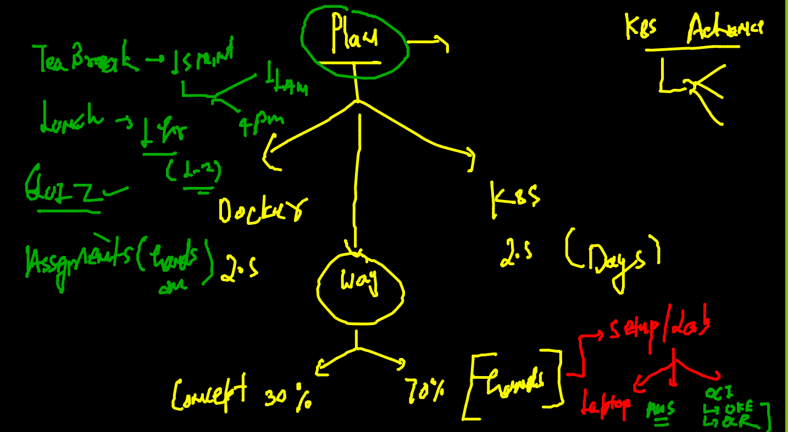
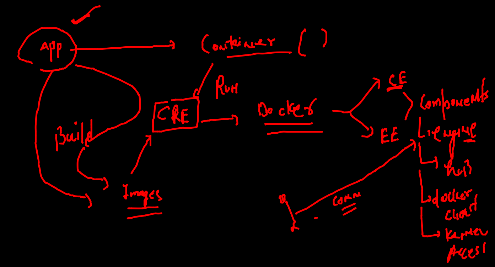
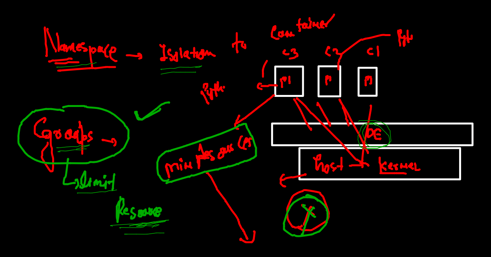

# Training Plan 



## Revision 




### Namespaces and cgroups 



### apply cgroups for RAM and CPU consumption 

```
1005  docker  run -itd --name ashuc2 --memory 100m alpine ping fb.com 
 1006  history 
 1007  docker stats
 1008  hisor
 1009  history 
 1010  docker  run -itd --name ashu23 --cpu-shares=30  --memory 100m alpine ping fb.com 
 
```


