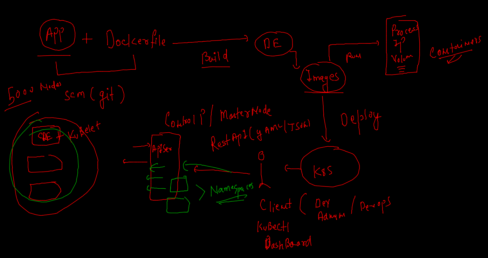
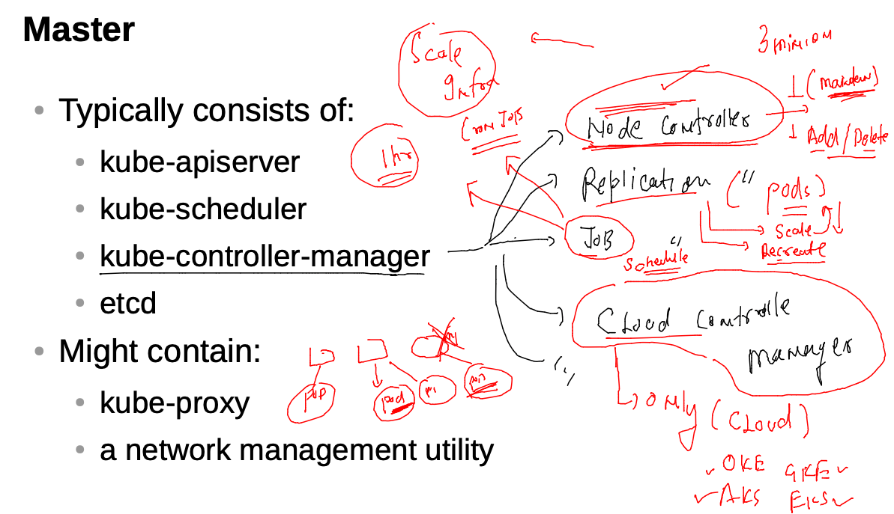
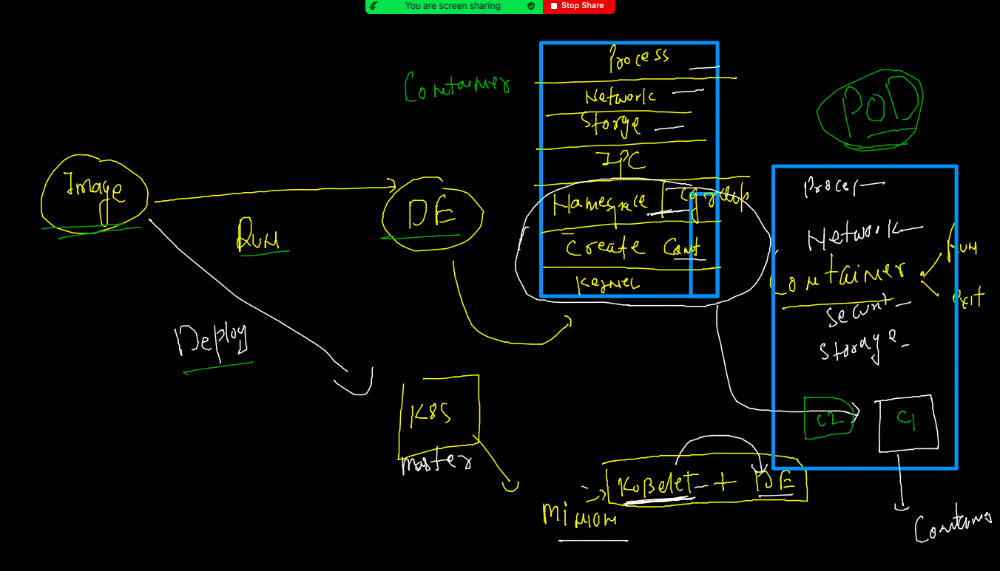
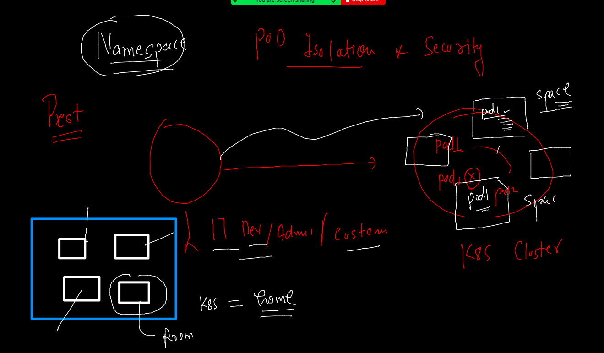

# Training Plan 


### k8s REvision 



### k8s master node components 



### Understanding POD 



### POd explanation 

```
kubectl  explain  pod
KIND:     Pod
VERSION:  v1

DESCRIPTION:
     Pod is a collection of containers that can run on a host. This resource is
     created by clients and scheduled onto hosts.

FIELDS:
   apiVersion	<string>
     APIVersion defines the versioned schema of this representation of an
     object. Servers should convert recognized schemas to the latest internal
     value, and may reject unrecognized values. More info:
     https://git.k8s.io/community/contributors/devel/sig-architecture/api-conventions.md#resources

   kind	<string>
     Kind is a string value representing the REST resource 
     
     
```

### First POd Info 

```
apiVersion: v1 # apiversion running on master node related to POD request 
kind: Pod
metadata: # info about Kind {Pod}
 name: ashupodx1 # name of Kind {POd}
spec: # is about application info like container / storage / security -etc
 containers: # one or more containers 
 - name: ashuc1
   image: alpine123344 
   command: ['sh','-c','ping google.com'] 
   
   
```

### Delete all the POds 

```
kubectl delete pods --all    
pod "aishpod-1" deleted
pod "aishpodx1" deleted
pod "ashupod-1" deleted
pod "chetabpod-1" deleted
pod "harikapod-1" deleted
pod "juhipod-1" deleted

```

### creating first pod 

```
kubectl apply -f  newpod.yaml 
pod/ashupodx1 created
 fire@ashutoshhs-MacBook-Air  ~/Desktop/k8sapps  kubectl get  pods
NAME         READY   STATUS             RESTARTS   AGE
aishpodx1    1/1     Running            0          27s
ashupodx1    0/1     ImagePullBackOff   0          13s
sunilpodx1   0/1     ErrImagePull       0          35s

```

### Note: Image name or access is leading to both the problem -- ImagePullBackOff , ErrImagePull

### get the details about internal things 

```
kubectl describe pod ashupodx1 
Name:         ashupodx1
Namespace:    default
Priority:     0
Node:         minion1/172.31.64.197
Start Time:   Thu, 09 Dec 2021 10:37:00 +0530
Labels:       <none>
Annotations:  cni.projectcalico.org/containerID: 1f4a508816aa346963569100fbb4bb5be3ab48d1ef0ceb926b3e2c80832a35b4
              cni.projectcalico.org/podIP: 192.168.34.36/32
              cni.projectcalico.org/podIPs: 192.168.34.36/32
Status:       Pending
IP:           192.168.34.36
IPs:
  IP:  192.168.34.36
Containers:

```

### access container shell running inside POD 

```
kubectl exec -it  ashupodx1  -- sh
/ # cat  /etc/os-release 
NAME="Alpine Linux"
ID=alpine
VERSION_ID=3.15.0
PRETTY_NAME="Alpine Linux v3.15"
HOME_URL="https://alpinelinux.org/"
BUG_REPORT_URL="https://bugs.alpinelinux.org/"
/ # ps -e
PID   USER     TIME  COMMAND
    1 root      0:00 ping google.com
    7 root      0:00 sh
   15 root      0:00 ps -e
/ # exit

```
### Generate YAML /JSON for POD 

```
kubectl  run  ashupod111  --image=alpine  --command ping fb.com  --dry-run=client       -o  yaml 
apiVersion: v1
kind: Pod
metadata:
  creationTimestamp: null
  labels:
    run: ashupod111
  name: ashupod111
spec:
  containers:
  - command:
    - ping
    - fb.com
    image: alpine
    name: ashupod111
    resources: {}
  dnsPolicy: ClusterFirst
  restartPolicy: Always
status: {}


```

### JSOn format 

```
kubectl  run  ashupod111  --image=alpine  --command ping fb.com  --dry-run=client       -o json
```

### store output in a file 

```
kubectl  run  ashupod111  --image=alpine  --command ping fb.com  --dry-run=client       -o  yaml  >autogen.yaml
```

### apply and delete using json 

```
kubectl apply -f autogen.json 
pod/ashupod111 created
 fire@ashutoshhs-MacBook-Air  ~/Desktop/k8sapps  kubectl  get po
NAME          READY   STATUS              RESTARTS   AGE
ashupod111    1/1     Running             0          6s
sunilpod111   0/1     ContainerCreating   0          1s
 fire@ashutoshhs-MacBook-Air  ~/Desktop/k8sapps  kubectl delete  -f autogen.json
pod "ashupod111" deleted

```

### Namespace in k8s for user/customer/admin/dev /devops  space 



### k8s internal components 

```
ubectl  get namespaces 
NAME                   STATUS   AGE
default                Active   18h
ingress-nginx          Active   17h
kube-node-lease        Active   18h
kube-public            Active   18h
kube-system            Active   18h
kubernetes-dashboard   Active   17h
 fire@ashutoshhs-MacBook-Air  ~/Desktop/k8sapps  kubectl  get pods -n  kube-system
NAME                                       READY   STATUS    RESTARTS      AGE
calico-kube-controllers-647d84984b-p4ks5   1/1     Running   2 (16h ago)   18h
calico-node-gh7c7                          1/1     Running   2 (16h ago)   18h
calico-node-shhgl                          1/1     Running   2 (16h ago)   18h
calico-node-v72vl                          1/1     Running   2 (16h ago)   18h
coredns-64897985d-g5w7b                    1/1     Running   2 (16h ago)

```

### creating namespaces 

```
kubectl  create  namespace  ashu-space --dry-run=client  -o yaml
apiVersion: v1
kind: Namespace
metadata:
  creationTimestamp: null
  name: ashu-space
spec: {}
status: {}
 fire@ashutoshhs-MacBook-Air  ~/Desktop/k8sapps  kubectl  create  namespace  ashu-space                namespace/ashu-space created
 fire@ashutoshhs-MacBook-Air  ~/Desktop/k8sapps  kubectl  get ns                  NAME                   STATUS   AGE
ashu-space             Active   8s
default                Active   18h

```

### Deploy pod in custom namespace 

```
kubectl apply -f autogen.yaml -n  ashu-space 
pod/ashupod111 created
 fire@ashutoshhs-MacBook-Air  ~/Desktop/k8sapps  
 fire@ashutoshhs-MacBook-Air  ~/Desktop/k8sapps  kubectl get pods
No resources found in default namespace.
 fire@ashutoshhs-MacBook-Air  ~/Desktop/k8sapps  kubectl get pods -n  ashu-space 
NAME         READY   STATUS    RESTARTS   AGE
ashupod111   1/1     Running   0          11s

```

### 

```
kubectl get pods -n  ashu-space 
NAME         READY   STATUS    RESTARTS   AGE
ashupod111   1/1     Running   0          11s
 fire@ashutoshhs-MacBook-Air  ~/Desktop/k8sapps  kubectl  -n  ashu-space  get  pods
NAME         READY   STATUS    RESTARTS   AGE
ashupod111   1/1     Running   0          57s
 fire@ashutoshhs-MacBook-Air  ~/Desktop/k8sapps  kubectl  -n  ashu-space  delete   pods  ashupod111
pod "ashupod111" deleted


```

### Namespace in yaml file

```
apiVersion: v1
kind: Pod
metadata:
  namespace: ashu-space # info about Namespace 
  creationTimestamp: null
  labels:
    run: ashupod111
  name: ashupod111 # name of pod 
spec:
  containers:
  - command: # process of container 
    - ping
    - fb.com
    image: alpine # image name 
    name: ashupod111 # container name 
    resources: {} # for cgroups 
  dnsPolicy: ClusterFirst
  restartPolicy: Always # restart policy 
status: {}


```

### to set default namespace in client side

```

 fire@ashutoshhs-MacBook-Air  ~/Desktop/k8sapps  kubectl  config set-context  --current --namespace=ashu-space 
Context "kubernetes-admin@kubernetes" modified.
 fire@ashutoshhs-MacBook-Air  ~/Desktop/k8sapps  kubectl  config get-contexts
CURRENT   NAME                          CLUSTER      AUTHINFO           NAMESPACE
*         kubernetes-admin@kubernetes   kubernetes   kubernetes-admin   ashu-space
 fire@ashutoshhs-MacBook-Air  ~/Desktop/k8sapps  
 fire@ashutoshhs-MacBook-Air  ~/Desktop/k8sapps  kubectl  get  pods
No resources found in ashu-space namespace.
 fire@ashutoshhs-MacBook-Air  ~/Desktop/k8sapps  
 
 
 ```
 
 
