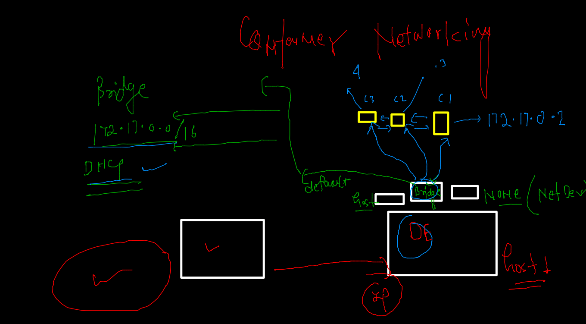
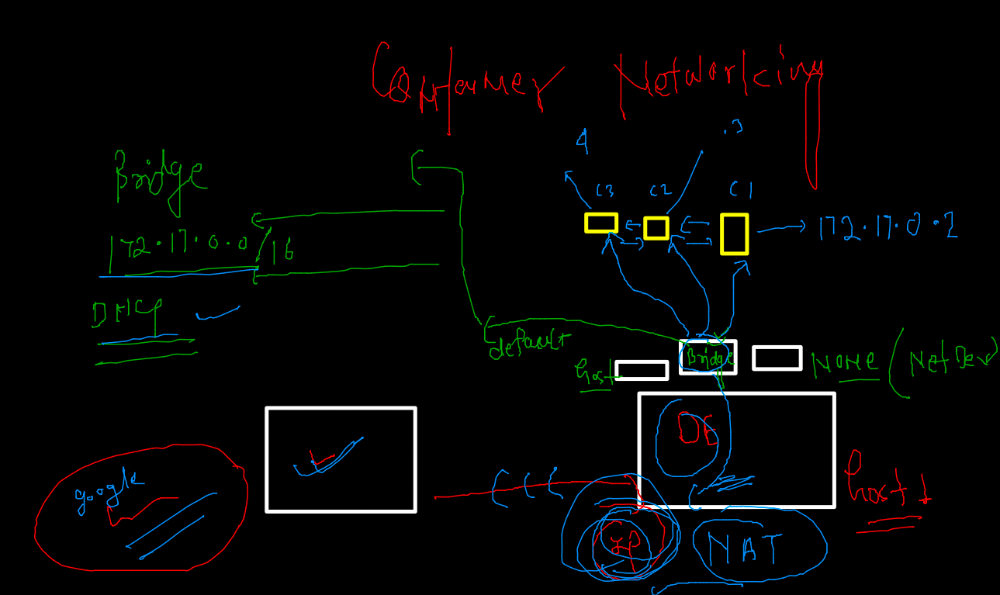
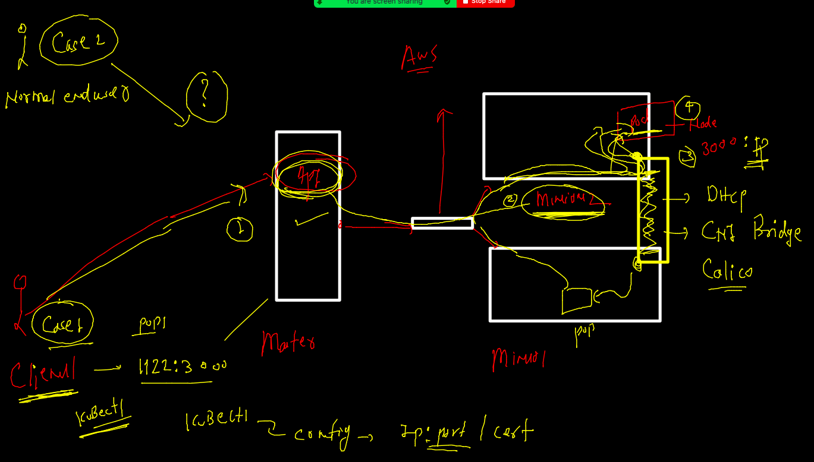
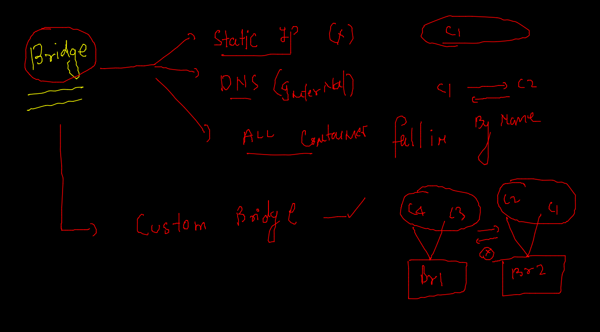

# Training Plan 


## Revision 


### Namespaces and cgroups 


### apply cgroups for RAM and CPU consumption 

```
1005  docker  run -itd --name ashuc2 --memory 100m alpine ping fb.com 
 1006  history 
 1007  docker stats
 1008  hisor
 1009  history 
 1010  docker  run -itd --name ashu23 --cpu-shares=30  --memory 100m alpine ping fb.com 
 
```

### DOcker registry 


### Docker hub registry 


## image pushing to docker hub from docker host 

### tag image as per docker hub standard 

```
docker tag  a0f1dd29f90b  docker.io/dockerashu/oracleindia:dec72021 
=== OR 
docker tag  ashualp:pycodev1  docker.io/dockerashu/oracleindia:dec72021 

```

### login to docker hub account from Docker host 

```
 docker  login 
Login with your Docker ID to push and pull images from Docker Hub. If you don't have a Docker ID, head over to https://hub.docker.com to create one.
Username: dockerashu
Password: 
WARNING! Your password will be stored unencrypted in /home/test/.docker/config.json.
Configure a credential helper to remove this warning. See
https://docs.docker.com/engine/reference/commandline/login/#credentials-store

Login Succeeded

```

### pushing image to hub 

```
docker push dockerashu/oracleindia:dec72021
The push refers to repository [docker.io/dockerashu/oracleindia]
1cbfa46102dd: Pushed 
b29741d18a4a: Pushed 
2898e0f03f21: Pushed 
8d3ac3489996: Mounted from sunilsaini/oracleindia

```

### docker logout 

```
 docker logout 
Removing login credentials for https://index.docker.io/v1/

```

### Java code based dockerfile 

```
FROM openjdk
#  predefine jdk image from docker HUB 
LABEL email="ashutoshh@linux.com"
RUN mkdir /code 
COPY hello.java /code/ 
WORKDIR /code 
# to change directory during image build time only 
RUN javac hello.java
# compling 
CMD ["java","myclass"]
# default parent process for java 

```

### Image building ..

```
docker build -t  dockerashu/oracleindia:javacode . 
Sending build context to Docker daemon  3.072kB
Step 1/7 : FROM openjdk
 ---> 1b3756d6df61
Step 2/7 : LABEL email="ashutoshh@linux.com"
 ---> Running in fa979a0c1da5
Removing intermediate container fa979a0c1da5
 ---> cd10e7d0f2ce
Step 3/7 : RUN mkdir /code
 ---> Running in 5fb038244b3f
Removing intermediate container 5fb038244b3f
 ---> 09b367d07bae
Step 4/7 : COPY hello.java /code/
 ---> b1a5424c4a54
Step 5/7 : WORKDIR /code
 ---> Running in a69eb185089b
Removing intermediate container a69eb185089b
 ---> 8c8f65f5e8d4
Step 6/7 : RUN javac hello.java
 ---> Running in 9923e7891e10
Removing intermediate container 9923e7891e10
 ---> dc673cc771e5
Step 7/7 : CMD ["java","myclass"]
 ---> Running in 04909995445a
Removing intermediate container 04909995445a
 ---> d27c17f0f9dd
Successfully built d27c17f0f9dd
Successfully tagged dockerashu/oracleindia:javacode

```

### creating container 

```
docker  run -itd --name ashujc1 --memory 200m --restart always dockerashu/oracleindia:javacode

```

### checking jdk version inside container image 

```
 docker  exec -it  ashujc1  bash 
bash-4.4# 
bash-4.4# 
bash-4.4# cat  /etc/os-release 
NAME="Oracle Linux Server"
VERSION="8.5"
ID="ol"
ID_LIKE="fedora"
VARIANT="Server"
VARIANT_ID="server"
VERSION_ID="8.5"
PLATFORM_ID="platform:el8"
PRETTY_NAME="Oracle Linux Server 8.5"
ANSI_COLOR="0;31"
CPE_NAME="cpe:/o:oracle:linux:8:5:server"
HOME_URL="https://linux.oracle.com/"
BUG_REPORT_URL="https://bugzilla.oracle.com/"

ORACLE_BUGZILLA_PRODUCT="Oracle Linux 8"
ORACLE_BUGZILLA_PRODUCT_VERSION=8.5
ORACLE_SUPPORT_PRODUCT="Oracle Linux"
ORACLE_SUPPORT_PRODUCT_VERSION=8.5
bash-4.4# java -version 
openjdk version "17.0.1" 2021-10-19
OpenJDK Runtime Environment (build 17.0.1+12-39)
OpenJDK 64-Bit Server VM (build 17.0.1+12-39, mixed mode, sharing)
bash-4.4# 

```

## Docker Networking 




### checking container Ip address 

```
 docker exec -it  ashuc1  sh 
/ # ifconfig 
eth0      Link encap:Ethernet  HWaddr 02:42:AC:11:00:02  
          inet addr:172.17.0.2  Bcast:172.17.255.255  Mask:255.255.0.0
          UP BROADCAST RUNNING MULTICAST  MTU:1500  Metric:1
          RX packets:12 errors:0 dropped:0 overruns:0 frame:0
          TX packets:0 errors:0 dropped:0 overruns:0 carrier:0
          collisions:0 txqueuelen:0 
          RX bytes:960 (960.0 B)  TX bytes:0 (0.0 B)
          
          
```

### json formating to get IPaddress 

```
docker  inspect  ashuc1 --format='{{.Id}}'
34ec23953ccb5d11ca8c30c488d3ff336d4064c5519090d219df6f88fb359673
[test@ip-172-31-93-168 ashu_images]$ 
[test@ip-172-31-93-168 ashu_images]$ docker  inspect  ashuc1 --format='{{.State.Status}}'
running
[test@ip-172-31-93-168 ashu_images]$ docker  inspect  ashuc1 --format='{{.HostConfig.RestartPolicy.Name}}'
no
[test@ip-172-31-93-168 ashu_images]$ docker  inspect  ashuc1 --format='{{.NetworkSettings.IPAddress}}'
172.17.0.2

```

### Due to NAT on Host machine each container can go outside host 

```
docker  exec -it  ashuc1  sh 
/ # 
/ # ping google.com 
PING google.com (172.217.164.142): 56 data bytes
64 bytes from 172.217.164.142: seq=0 ttl=110 time=0.508 ms
64 bytes from 172.217.164.142: seq=1 ttl=110 time=0.572 ms
64 bytes from 172.217.164.142: seq=2 ttl=110 time=0.560 ms
^C
--- google.com ping statistics ---
3 packets transmitted, 3 packets received, 0% packet loss
round-trip min/avg/max = 0.508/0.546/0.572 ms
/ # exit

```

### 



### Docker Network inspect 

```
docker network  inspect  f78361292230  
[
    {
        "Name": "bridge",
        "Id": "f7836129223025b135ddf3429fec0ae422c5cddd0f19507af6a19218e60bd1f7",
        "Created": "2021-12-07T04:16:15.52930862Z",
        "Scope": "local",
        "Driver": "bridge",
        "EnableIPv6": false,
        "IPAM": {
            "Driver": "default",
            "Options": null,
            "Config": [
                {
                    "Subnet": "172.17.0.0/16",
                    "Gateway": "172.17.0.1"
                }
            ]
        },
        "Internal": false,
        "Attachable": false,
        "Ingress": false,
        "ConfigFrom": {
            "Network": ""
        },
        "ConfigOnly": false,
        "Containers": {
            "0c811b595b3f0f6633c5c83cf3b18add67db27c02b8f4266faf8ee1416b8feb6": {
                "Name": "shubhpc1",
                "EndpointID": "ec67c2e8a351936cbd75f10bda44415430d58a83c91138f5d0962b3326fa2cc7",
                "MacAddress": "02:42:ac:11:00:0a",
                "IPv4Address": "172.17.0.10/16",
                "IPv6Address": ""
            },
            "0f01d4ecf4b6d5a41570c27492de818a54028ef3296e3ae67bd69cf1fcf30dfb": {
                "Name": "stupefied_jones",
                "EndpointID": "97c493906f3fecc0cd356aa365d1c16b3d88cba6687e711fc489204340ef235a",
                "MacAddress": "02:42:ac:11:00:12",
                "IPv4Address": "172.17.0.18/16",
                "IPv6Address": ""
            },
            "0f581a1090458a48b7dd1a3b36db3ba085ca0c0a3cbc4257aaa2e789ab5caf8a": {
                "Name": "PRAVc1",
                "EndpointID": "05dd970f306d6b5bff89992f2e24350a972f4ae79609cc295efb986f844cd9bf",
                "MacAddress": "02:42:ac:11:00:04",
                "IPv4Address": "172.17.0.4/16",
                "IPv6Address": ""
            },
            "172a32a3484228fc0c569c3e0967c061cc776e65347bb57a71ef9522dce72039": {
                "Name": "prabhatc1",
                "EndpointID": "c237270b3627ce689c1aba5bd57578149a3be9729326fe31294ea5d8ce4372e2",
                "MacAddress": "02:42:ac:11:00:05",
                "IPv4Address": "172.17.0.5/16",
                "IPv6Address": ""
            },
            "19bc36be978ce6fa0cb39bb5bdf1a9eb0bc8e93d8a325cefd2b83a1c3a2c232a": {
                "Name": "venunwk1",
                "EndpointID": "32b338c97a1b36c754689f2b63655feb8a585e8d41c80f46966eec3fcf23df93",
                "MacAddress": "02:42:ac:11:00:06",
                "IPv4Address": "172.17.0.6/16",
                "IPv6Address": ""
            },
            "1e581ea4e74c789ace3c8ef62d91b4856387f933e276bb2fccb62191f3af4ce0": {
                "Name": "sureshd1",
                "EndpointID": "5f4710639c5526d4ad18f6e423768ed4f1143c6da9e43ad031f19e962ebd3cd8",
                "MacAddress": "02:42:ac:11:00:09",
                "IPv4Address": "172.17.0.9/16",
                "IPv6Address": ""
            },
            "2eb06186794ea88d7927ffdbcadfe1be144c8864fd28ccd3834e5361df28cc60": {
                "Name": "rahulc1",
                "EndpointID": "9f53eda9ceeca919c362ea70c4a0ccb8e42d2390013f3a7a4e04354a46b3ca20",
                "MacAddress": "02:42:ac:11:00:07",
                "IPv4Address": "172.17.0.7/16",
                "IPv6Address": ""
            },
            "34ec23953ccb5d11ca8c30c488d3ff336d4064c5519090d219df6f88fb359673": {
                "Name": "ashuc1",
                "EndpointID": "c0f7bcc46ed6bcbd375c449031e481b572d96f81eaf9eaefa222334aab31e57f",
                "MacAddress": "02:42:ac:11:00:02",
                "IPv4Address": "172.17.0.2/16",
                "IPv6Address": ""
            },
            "4bee5070ad1d279743a89188221faaa8feac2076ac34365f3dd6b3802d8764a1": {
                "Name": "sneha1",
                "EndpointID": "74740da1b6303789e05146690482c73324b43fa26eb0dad759e290fff0a06f04",
                "MacAddress": "02:42:ac:11:00:0b",
                "IPv4Address": "172.17.0.11/16",
                "IPv6Address": ""
            },
            "70f74efc96599f1e118e9473728b1c5de2a70b1d17c3b6a7b12e40ba53d84591": {
                "Name": "sbandem1",
                "EndpointID": "3365f5be9bcc66608377ad38d06a37f45916b75e266816583987d938d7e7774e",
                "MacAddress": "02:42:ac:11:00:0c",
                "IPv4Address": "172.17.0.12/16",
                "IPv6Address": ""
            },
            "754066d3b4147612fc6b10be48590f55aed3588065a4f4c35b0a683e964ecd0b": {
                "Name": "epic_pare",
                "EndpointID": "973b4b9aa9658fadc159da0a2295ab7c919e5c893811f540443d3a2ffd9186c4",
                "MacAddress": "02:42:ac:11:00:11",
                "IPv4Address": "172.17.0.17/16",
                "IPv6Address": ""
            },
            "7c22ee7be297a6623b33044b28709a96dcb6b8900a870733ab04843878b60baa": {
                "Name": "prasun",
                "EndpointID": "84fd9abcdb786b34f0a10a49d7338f656418f18d912ad5570632b2cd4008d4d3",
                "MacAddress": "02:42:ac:11:00:10",
                "IPv4Address": "172.17.0.16/16",
                "IPv6Address": ""
            },
            "7f7997b835aa847d433892ffe9d1038f61bb462b6f915f0aafc2a83ee08b7286": {
                "Name": "shipranet",
                "EndpointID": "ed39b863acb48e00e63d6b0b42a3be3a11c580fc3dd1089d7709672c25d98d0d",
                "MacAddress": "02:42:ac:11:00:0d",
                "IPv4Address": "172.17.0.13/16",
                "IPv6Address": ""
                
                
```

### Docker Host Port forwarding 




### port forwarding demo 

```
git  clone  https://github.com/yenchiah/project-website-template

```

### Dockerfile 
```
FROM oraclelinux:8.5 
LABEL name="ashutoshh"
RUN  yum install httpd -y 
COPY . /var/www/html/ 
# copy all the data to httpd document root 
# COPY or ADD will check for .dockerignore first 
CMD ["httpd","-DFOREGROUND"]

```

# to start web server 


### .dockerignore 

```
Dockerfile
.dockerignore
.gitignore
.git
*.md
LICENSE


```

### Image build 


```

 ls
css         embedding.html  img         js       menu.html  vid
Dockerfile  empty.html      index.html  LICENSE  README.md  widgets.html
[test@ip-172-31-93-168 project-website-template]$ docker  build -t dockerashu/oracleindia:webapp1 . 
Sending build context to Docker daemon  1.004MB
Step 1/5 : FROM oraclelinux:8.5
 ---> fa4253e97227
Step 2/5 : LABEL name="ashutoshh"
 ---> Using cache
 ---> 2f5b0a3d82a0
Step 3/5 : RUN  yum install httpd -y
 ---> Running in ceaf44c1d430
Oracle Linux 8 BaseOS Latest (x86_64)            75 MB/s |  40 MB     00:00    
Oracle Linux 8 Application Stream (x86_64)       43 MB/s |  31 MB     00:00    
Last metadata expiration check: 0:00:14 ago on Tue Dec  7 09:27:24 2021.
Dependencies resolved.
==================================================================================================
 Package              Arch    Version                                     Repository          Size
=============================================================

```

### Creating container 

```
docker  run -d  --name ashuwebc1  -p  1111:80  dockerashu/oracleindia:webapp1
69715ebc288e64cb3a1ac202ed0ac39c21f37b2747bcd0050dc4f91d8ac6c0a5
[test@ip-172-31-93-168 project-website-template]$ 
[test@ip-172-31-93-168 project-website-template]$ 
[test@ip-172-31-93-168 project-website-template]$ docker  ps
CONTAINER ID   IMAGE                            COMMAND                CREATED         STATUS         PORTS                                   NAMES
69715ebc288e   dockerashu/oracleindia:webapp1   "httpd -DFOREGROUND"   3 seconds ago   Up 2 seconds   0.0.0.0:1111->80/tcp, :::1111->80/tcp   ashuwebc1
[test@ip-172-31-93-168 project-website-template]$ 

```

### Custom bride need 



### 

```
docker network ls
NETWORK ID     NAME      DRIVER    SCOPE
f78361292230   bridge    bridge    local
8731d1a03487   host      host      local
1413ba13fd3d   none      null      local

```

### creating bridge 

```
 docker  network create  ashubr1 
docker  network create  ashubr2  --subnet  192.168.1.0/24 
759aab80ffed0b220a786ffe5b6f0b2cfd96c33bd9deb6685834ee4003a45bf4
[test@ip-172-31-93-168 project-website-template]$ docker network ls
NETWORK ID     NAME      DRIVER    SCOPE
6fdfd992d922   ashubr1   bridge    local
759aab80ffed   ashubr2   bridge    local
f78361292230   bridge    bridge    local
8731d1a03487   host      host      local
1413ba13fd3d   none      null      local

```

### name based commnication 

```
 docker run -tid  --name x1br1  --network  ashubr1  alpine 
4c23f350799581f9233d3b3ff0a9240d9b62967600a4c520db2f592fb280543c
[test@ip-172-31-93-168 project-website-template]$ 
[test@ip-172-31-93-168 project-website-template]$ docker run -tid  --name x2br1  --network  ashubr1  alpine 
8a6e956c4292012409092f41d75dd4c6f713c9147440fda398ebe72c3a70a497
[test@ip-172-31-93-168 project-website-template]$ 
[test@ip-172-31-93-168 project-website-template]$ docker  exec -it x1br1 sh 
/ # ping x2br1
PING x2br1 (172.18.0.3): 56 data bytes
64 bytes from 172.18.0.3: seq=0 ttl=255 time=0.109 ms
64 bytes from 172.18.0.3: seq=1 ttl=255 time=0.099 ms
^C
--- x2br1 ping statistics ---
2 packets transmitted, 2 packets received, 0% packet loss
round-trip min/avg/max = 0.099/0.104/0.109 ms
/ # exit

```

### static ip to container 

```
docker run -tid  --name x2br2  --network  ashubr2 --ip  192.168.1.100  alpine 
261fb0a9ce7a1d5a190c7585068d602648d9c99f4bc43a4d3586b3bc72e61020
[test@ip-172-31-93-168 project-website-template]$ 
[test@ip-172-31-93-168 project-website-template]$ 
[test@ip-172-31-93-168 project-website-template]$ docker  exec -it x2br2 sh 
/ # ifconfig 
eth0      Link encap:Ethernet  HWaddr 02:42:C0:A8:01:64  
          inet addr:192.168.1.100  Bcast:192.168.1.255  Mask:255.255.255.0
          UP BROADCAST RUNNING MULTICAST  MTU:1500  Metric:1
          RX packets:10 errors:0 dropped:0 overruns:0 frame:0
          TX packets:0 errors:0 dropped:0 overruns:0 carrier:0
          collisions:0 txqueuelen:0 
          RX bytes:860 (860.0 B)  TX bytes:0 (0.0 B)

lo        Link encap:Local Loopback  
          inet addr:127.0.0.1  Mask:255.0.0.0
          UP LOOPBACK RUNNING  MTU:65536  Metric:1
          RX packets:0 errors:0 dropped:0 overruns:0 frame:0
          TX packets:0 errors:0 dropped:0 overruns:0 carrier:0
          collisions:0 txqueuelen:1000 
          RX bytes:0 (0.0 B)  TX bytes:0 (0.0 B)

/ # exit

```
### Docker Storage 


### creating a database volume 

```
docker  volume  create  ashudb 
ashudb
[test@ip-172-31-93-168 project-website-template]$ docker  volume  ls
DRIVER    VOLUME NAME
local     06a13f95ddf2ab1c147b0ff1587559b7352cd720285cb5b3bb4644e18766b58a
local     38fcc6ffbd60ff10c803a2c835e982d1344214cdc1f514aad75dca40c9b3cbff
local     ashudb
local     d1e7c70ff62556f16df603495de2d60045e2656d87c783bdebac7714ed533de8
[test@ip-172-31-93-168 project-website-template]$ docker  volume   inspect  ashudb 
[
    {
        "CreatedAt": "2021-12-07T11:07:00Z",
        "Driver": "local",
        "Labels": {},
        "Mountpoint": "/var/lib/docker/volumes/ashudb/_data",
        "Name": "ashudb",
        "Options": {},
        "Scope": "local"
    }
]
[test@ip-172-31-93-168 project-website-template]$ 

```

### creating database mysql container 

```
 1058  docker  run -d --name ashudb1 -v ashudb:/var/lib/mysql  -e MYSQL_ROOT_PASSWORD=Oracle088#  mysql
 1059  history 
[test@ip-172-31-93-168 project-website-template]$ docker rm  ashudb -f
ashudb
[test@ip-172-31-93-168 project-website-template]$ docker ps
CONTAINER ID   IMAGE     COMMAND                  CREATED              STATUS              PORTS                 NAMES
d595bbc18eb9   mysql     "docker-entrypoint.s…"   20 seconds ago       Up 19 seconds       3306/tcp, 33060/tcp   snehadb
7ad24ef53c41   mysql     "docker-entrypoint.s…"   37 seconds ago       Up 36 seconds       3306/tcp, 33060/tcp   rahuldb
f3b2ee09c962   mysql     "docker-entrypoint.s…"   About a minute ago   Up About a minute   3306/tcp, 33060/tcp   ashudb1
284c330a3cbd   alpine    "ping localhost"         3 minutes ago        Up 3 minutes                              aishbrx2
[test@ip-172-31-93-168 project-website-template]$ docker  logs ashudb1
2021-12-07 11:09:28+00:00 [Note] [Entrypoint]: Entrypoint script for MySQL Server 8.0.27-1debian10 started.
2021-12-07 11:09:28+00:00 [Note] [Entrypoint]: Switching to dedicated user 'mysql'
2021-12-07 11:09:28+00:00 [Note] [Entrypoint]: Entrypoint script for MySQL Server 8.0.27-1debian10 started.
2021-12-07 11:09:28+00:00 [Note] [Entrypoint]: Initializing database files
2021-12-07T11:09:28.494050Z 0 [System] [MY-013169] [Server] /usr/sbin/mysqld (mysqld 8.0.27) initializing of server in progress as process 43

```

### login to database container 

```
docker  exec -it ashudb1 bash 
root@f3b2ee09c962:/# cat  /etc/os-release 
PRETTY_NAME="Debian GNU/Linux 10 (buster)"
NAME="Debian GNU/Linux"
VERSION_ID="10"
VERSION="10 (buster)"
VERSION_CODENAME=buster
ID=debian
HOME_URL="https://www.debian.org/"
SUPPORT_URL="https://www.debian.org/support"
BUG_REPORT_URL="https://bugs.debian.org/"
root@f3b2ee09c962:/# mysql -u root -p 
Enter password: 
Welcome to the MySQL monitor.  Commands end with ; or \g.
Your MySQL connection id is 8
Server version: 8.0.27 MySQL Community Server - GPL

Copyright (c) 2000, 2021, Oracle and/or its affiliates.

Oracle is a registered trademark of Oracle Corporation and/or its
affiliates. Other names may be trademarks of their respective
owners.

Type 'help;' or '\h' for help. Type '\c' to clear the current input statement.

mysql> 

```


