##  Training Plan 


### apps to test and deploy 

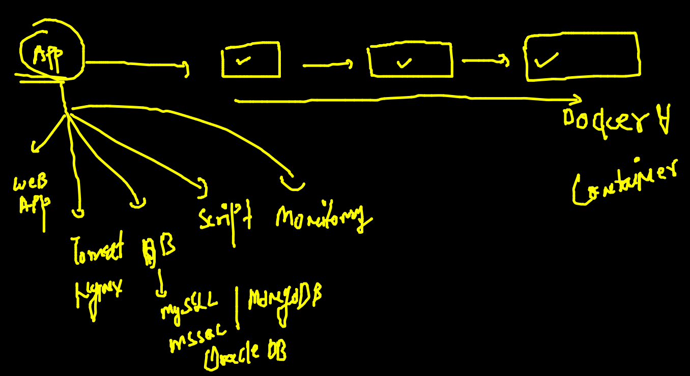

## problems 

### app libs comptability 


### intro to hypervisors {virtaulization}

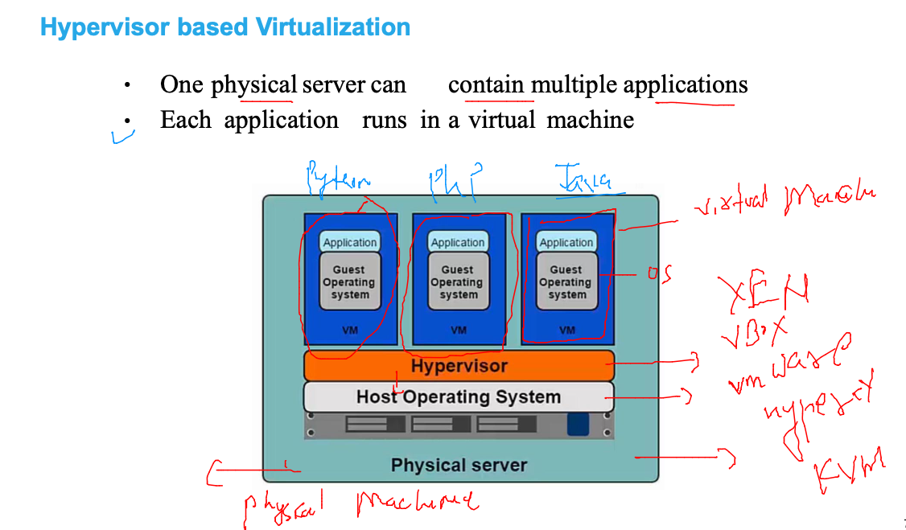

### vm problem 1 

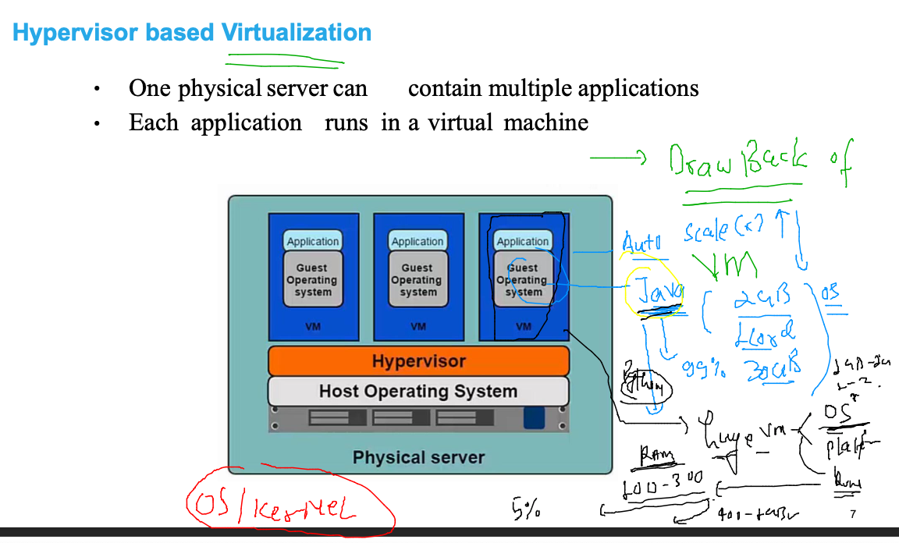

### vm problem 2 

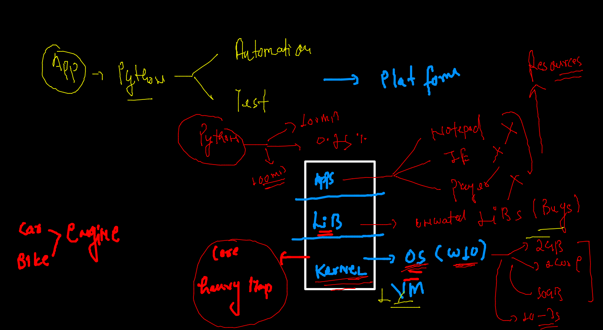

## WElcome to CRE (Container runtime Engines)

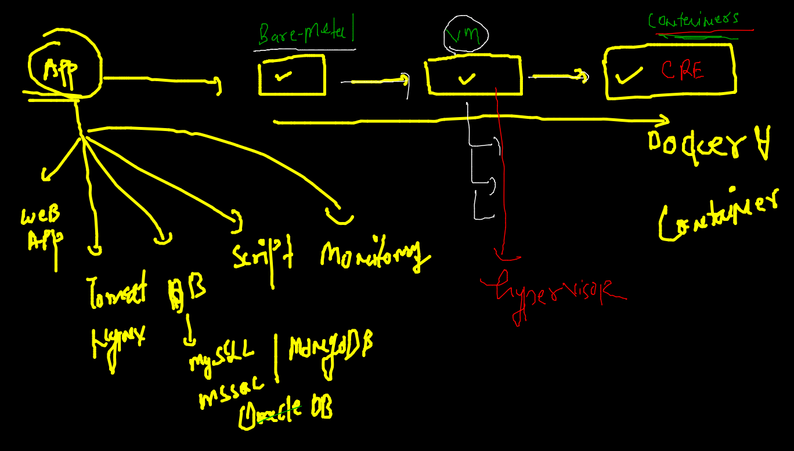

### CRE 

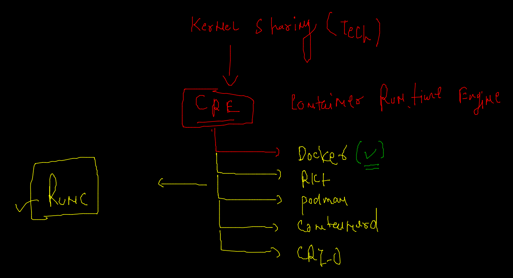

### CRE vs hypervisor 


### Docker as CRE 


### Installing docker 


### Docker Desktop for MAC 

[INstalllink](https://hub.docker.com/editions/community/docker-ce-desktop-mac)

### Docker Desktop for windows 10 / 11 

### checking after installation 

```
docker  -v 
Docker version 20.10.8, build 3967b7d
 fire@ashutoshhs-MacBook-Air  ~  docker  version 
Client:
 Cloud integration: 1.0.17
 Version:           20.10.8
 API version:       1.41
 Go version:        go1.16.6
 Git commit:        3967b7d
 Built:             Fri Jul 30 19:55:20 2021
 OS/Arch:           darwin/amd64
 Context:           default
 Experimental:      true

Server: Docker Engine - Community
 Engine:
  Version:          20.10.8
  API version:      1.41 (minimum version 1.12)
  Go version:       go1.16.6
  Git commit:       75249d8
  Built:            Fri Jul 30 19:52:31 2021
  OS/Arch:          linux/amd64

```

### Install in Linux Host : centos / rhel / OL 

```
 yum  install docker -y
Loaded plugins: extras_suggestions, langpacks, priorities, update-motd
Resolving Dependencies
--> Running transaction check
---> Package docker.x86_64 0:20.10.7-5.amzn2 will be installed
--> Processing Dependency: runc >= 1.0.0 for package: docker-20.10.7-5.amzn2.x86_64
--> Processing Dependency: libcgroup >= 0.40.rc1-5.15 for package: docker-20.10.7-5.a
mzn2.x86_64
--> Processing Dependency: containerd >= 1.3.2 for package: docker-20.10.7-5.amzn2.x8
6_64
--> Processing Dependency: pigz for package: docker-20.10.7-5.amzn2.x86_64
--> Running transaction check
---> Package containerd.x86_64 0:1.4.6-7.amzn2 will be installed
---> Package libcgroup.x86_64 0:0.41-21.amzn2 will be installed
---> Package pigz.x86_64 0:2.3.4-1.amzn2.0.1 will be installed
---> Package runc.x86_64 0:1.0.0-2.amzn2 will be installed
--> Finished Dependency Resolution

```


### Starting docker engine service 

```
 systemctl enable --now docker 
Created symlink from /etc/systemd/system/multi-user.target.wants/docker.service to /u
sr/lib/systemd/system/docker.service.
[root@ip-172-31-93-168 ~]# systemctl status docker 
● docker.service - Docker Application Container Engine
   Loaded: loaded (/usr/lib/systemd/system/docker.service; enabled; vendor preset: di
sabled)
   Active: active (running) since Mon 2021-12-06 06:11:53 UTC; 9s ago
     Docs: https://docs.docker.com
  Process: 3232 ExecStartPre=/usr/libexec/docker/docker-setup-runtimes.sh (code=exite
d, status=0/SUCCESS)
  Process: 3215 ExecStartPre=/bin/mkdir
  
 ```
  
 ### adding non root user in linux Host 
 
 ```
  5  useradd  test 
    6  usermod -aG docker test 
    7  echo "OracleDocker088"  |  passwd test --stind 
    
 ```
 
 ### Docker lab setup 
 
 
 
### Docker ENgine / server 

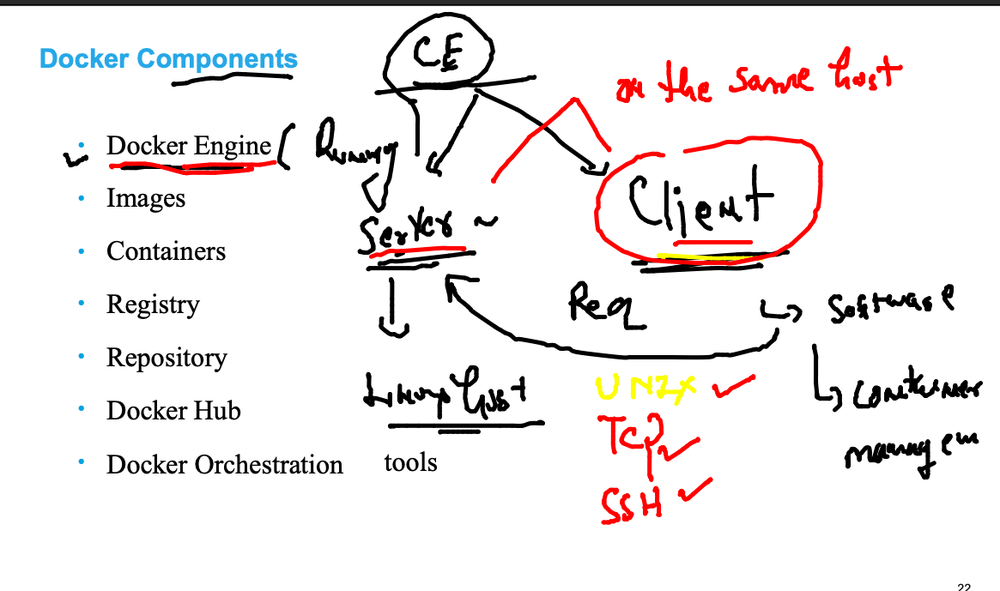

### Docker client and server 

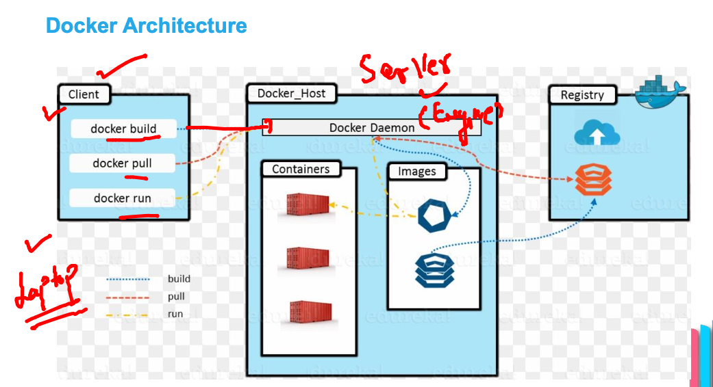

###  Container required docker images 

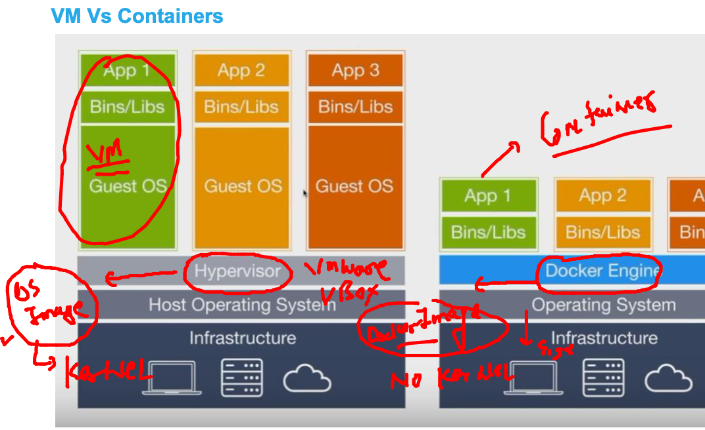

### Imgae registry like Docker hub 

### Docker client operations 

### checking local server images 

```
 docker   images
REPOSITORY   TAG       IMAGE ID   CREATED   SIZE
[test@ip-172-31-93-168 ~]$ 


```

### pulling image from docker hub to docker engine server 

```
$ docker   images
REPOSITORY   TAG       IMAGE ID   CREATED   SIZE
[test@ip-172-31-93-168 ~]$ docker  pull  openjdk 
Using default tag: latest
latest: Pulling from library/openjdk
28587b6e6475: Pull complete 
b1655352c888: Pull complete 
1f9646f00e96: Pull complete 
Digest: sha256:0e5ae79482731eef1526afb4e3a42e62b38142681c5752a944ff4236da979648
Status: Downloaded newer image for openjdk:latest
docker.io/library/openjdk:latest
[test@ip-172-31-93-168 ~]$ 
[test@ip-172-31-93-168 ~]$ docker   images
REPOSITORY   TAG       IMAGE ID       CREATED       SIZE
openjdk      latest    1b3756d6df61   2 weeks ago   471MB

```

### final docker images 

```
docker  images
REPOSITORY    TAG       IMAGE ID       CREATED       SIZE
mysql         latest    bbf6571db497   3 days ago    516MB
alpine        latest    c059bfaa849c   11 days ago   5.59MB
openjdk       latest    1b3756d6df61   2 weeks ago   471MB
oraclelinux   8.5       fa4253e97227   2 weeks ago   235MB

```

### pulling images from QYay 

```
$ docker pull quay.io/bitnami/tomcat  
Using default tag: latest
latest: Pulling from bitnami/tomcat
1d7019cad1df: Pull complete 
a30ebf93a11a: Pull complete 
20a11b4e2b3b: Pull complete 
8c1997a505fe: Pull complete 
65fdfb1b53db: Pull complete 

```

### pulling from non cloud oralce public registry 

```
 docker pull container-registry.oracle.com/java/openjdk:latest
latest: Pulling from java/openjdk
0b3f7bc5b3d7: Pull complete 
7ba4be1f9aef: Pull complete 
793b9263010a: Pull complete 
Digest: sha256:294490452d9030fdcb85a9ccd74e48bdacca8b028d022dc6700b56c82d746bed
Status: Downloaded newer image for container-registry.oracle.com/java/openjdk:latest

```

### on the docker server side images storage location 

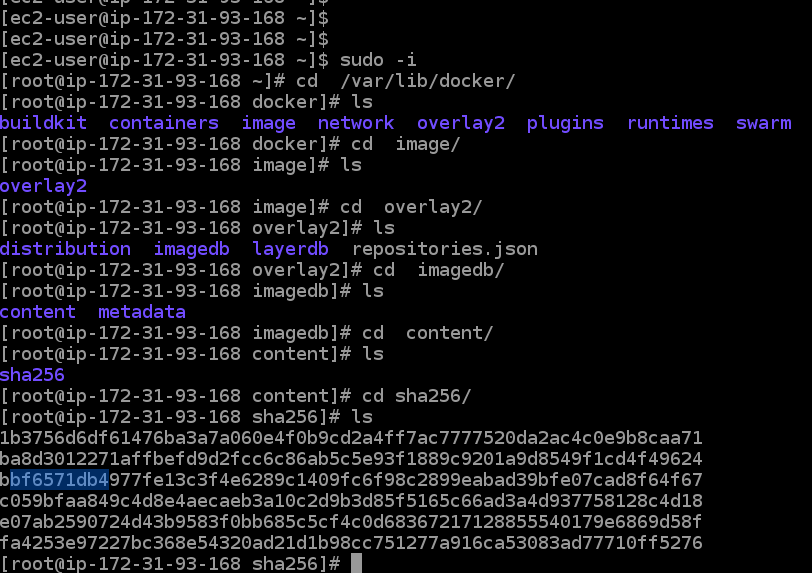

## Intro to containers 

###  container creation 

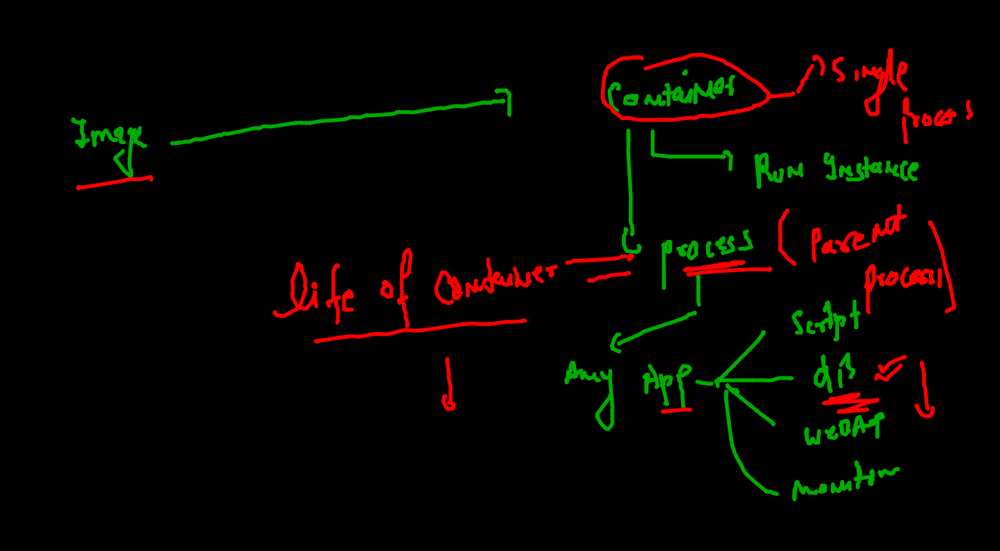

### creating container 

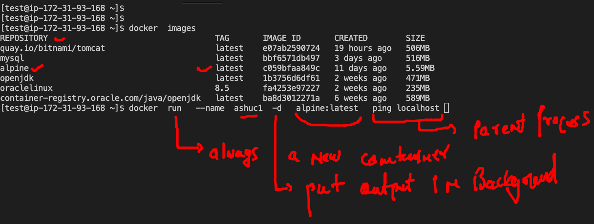

### creating container and listing it 

```
docker  run   --name  ashuc1  -d   alpine:latest   ping localhost 
bb5324a16d48ae7cc5670f92a18a637fd78eee7644de9c39b0c33e383afc029b
[test@ip-172-31-93-168 ~]$ 
[test@ip-172-31-93-168 ~]$ 
[test@ip-172-31-93-168 ~]$ 
[test@ip-172-31-93-168 ~]$ docker  ps
CONTAINER ID   IMAGE           COMMAND            CREATED          STATUS          PORTS     NAMES
0276fde63c1b   alpine:latest   "ping localhost"   22 seconds ago   Up 21 seconds             juhi_alpine
bb5324a16d48   alpine:latest   "ping localhost"   26 seconds ago   Up 24 seconds             ashuc1
[test@ip-172-31-93-168 ~]$ 

```

### checking output of container process 

```
 docker  logs   ashuc1  
PING localhost (127.0.0.1): 56 data bytes
64 bytes from 127.0.0.1: seq=0 ttl=255 time=0.038 ms
64 bytes from 127.0.0.1: seq=1 ttl=255 time=0.048 ms
64 bytes from 127.0.0.1: seq=2 ttl=255 time=0.056 ms
64 bytes from 127.0.0.1: seq=3 ttl=255 time=0.068 ms

==== for Live output 

 docker  logs  -f  ashuc1  
PING localhost (127.0.0.1): 56 data bytes
64 bytes from 127.0.0.1: seq=0 ttl=255 time=0.038 ms
64 bytes from 127.0.0.1: seq=1 ttl=255 time=0.048 ms
64 bytes from 127.0.0.1: seq=2 ttl=255 time=0.056 ms
64 bytes from 127.0.0.1: seq=3 ttl=255 time=0.068 ms

```

### to stop a running container 

```
docker  stop  ashuc1 
ashuc1

```

### start an existing container 

```
docker  start  ashuc1
ashuc1
[test@ip-172-31-93-168 ~]$ docker  ps
CONTAINER ID   IMAGE           COMMAND            CREATED         STATUS         PORTS     NAMES
faa9e721844a   alpine:latest   "ping localhost"   4 minutes ago   Up 4 minutes             sunil1stc
2518e90e5fa8   alpine:latest   "ping localhost"   5 minutes ago   Up 5 minutes             sneha2
9c814dc8a0fa   alpine:latest   "ping localhost"   5 minutes ago   Up 5 minutes             shubhamc
c46840dcb134   alpine:latest   "ping localhost"   6 minutes ago   Up 6 minutes             chetan06
605cdaeae70b   alpine:latest   "ping localhost"   7 minutes ago   Up 7 minutes             aiswarya_alpine
bb5324a16d48   alpine:latest   "ping localhost"   9 minutes ago   Up 2 seconds             ashuc1

```

### stop container immediately 

```
 docker  kill  ashuc1
ashuc1
[test@ip-172-31-93-168 ~]$ docker  start  ashuc1
ashuc1
[test@ip-172-31-93-168 ~]$ 

```

### Container child process 

```

[test@ip-172-31-93-168 ~]$ docker  exec    -it   ashuc1   sh 
/ # 
/ # 
/ # cat  /etc/os-release 
NAME="Alpine Linux"
ID=alpine
VERSION_ID=3.15.0
PRETTY_NAME="Alpine Linux v3.15"
HOME_URL="https://alpinelinux.org/"
BUG_REPORT_URL="https://bugs.alpinelinux.org/"
/ # uname  -r
4.14.252-195.483.amzn2.x86_64
/ # exit

```

### remove a non running container 

```
 docker  rm ashuc1
ashuc1

```

### kill all running containers 

```
docker kill  $(docker  ps  -q)
7584309d69df
65aa07d0eb05
2518e90e5fa8
9c814dc8a0fa
c46840dcb134
da24562440dd
eddc0f1cb512
605cdaeae70b
6f68969ae03a
0276fde63c1b

```

### remove all non running containers

```
 docker  rm $(docker  ps -aq)
51676645edb2
7584309d69df
65aa07d0eb05
faa9e721844a
2518e90e5fa8
9c814dc8a0fa
c46840dcb134
da24562440dd

```
### app containerization 
### image building process

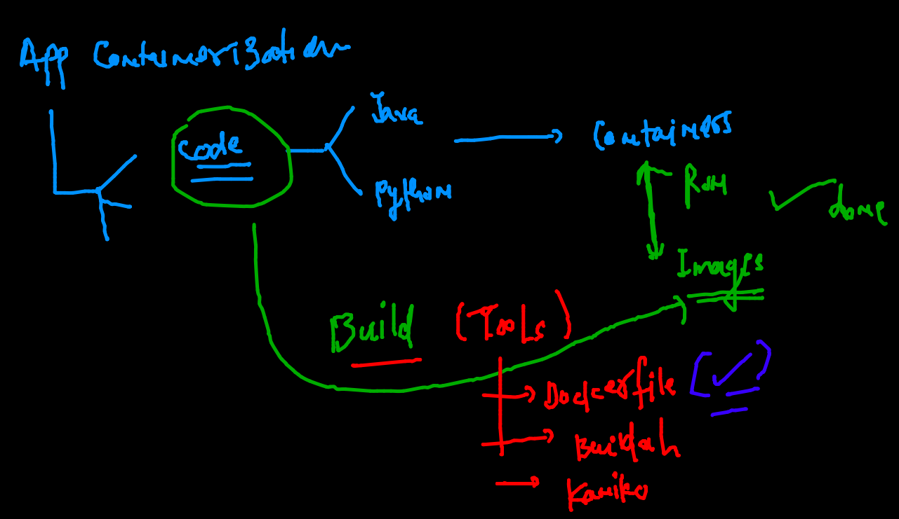

### building first image 

```
 docker build -t  ashupython:v1  .
```
 
 ### creating container 
 
 
 ```
 docker  run -it -d  --name ashupc1 ashupython:v1  
956ca3b2a422a1e89c907168ae89d0037a40376ce53e4f15e5031e95acb1d911
[test@ip-172-31-93-168 pythondemo]$ docker ps
CONTAINER ID   IMAGE           COMMAND                  CREATED         STATUS         PORTS     NAMES
956ca3b2a422   ashupython:v1   "python3 /code/oracl…"   3 seconds ago   Up 2 seconds             ashupc1
 
 ```
 
 ### checking resources by python container 
 
 ```
 [test@ip-172-31-93-168 pythondemo]$ docker  stats ashupc1
 
 CONTAINER ID   NAME      CPU %     MEM USAGE / LIMIT     MEM %     NET I/O     BLOCK I/O    PIDS
956ca3b2a422   ashupc1   0.00%     3.789MiB / 7.689GiB   0.05%     780B / 0B   4.1kB / 0B   1
^C


```

### Task 2 for alpine python image 

### Dockerfile 

```
FROM alpine
RUN  apk add python3  
# installer of alpine linux 
RUN mkdir /code1 
ADD https://raw.githubusercontent.com/redashu/pythonLang/main/while.py /code1/ 
# copy and add both are same but add can take data from URL as well
ENTRYPOINT ["python3","/code1/while.py"]
# CMD and Entrypoint both are same except 1 diff 

```

### build image 

```
 docker build -t  ashualp:pycodev1  -f  alpine.dockerfile  . 
Sending build context to Docker daemon  4.096kB
Step 1/5 : FROM alpine
 ---> c059bfaa849c
Step 2/5 : RUN  apk add python3
 ---> Running in b7a9339b8dde
fetch https://dl-cdn.alpinelinux.org/alpine/v3.15/main/x86_64/APKINDEX.tar.gz
fetch https://dl-cdn.alpinelinux.org/alpine/v3.15/community/x86_64/APKINDEX.tar.gz
(1/13) Installing libbz2 (1.0.8-r1)
(2/13) Installing expat (2.4.1-r0)
(3/13) Installing libffi (3.4.2-r1)
(4/13) Installing gdbm (1.22-r0)
(5/13) Installing xz-libs (5.2.5-r0)

```
 
