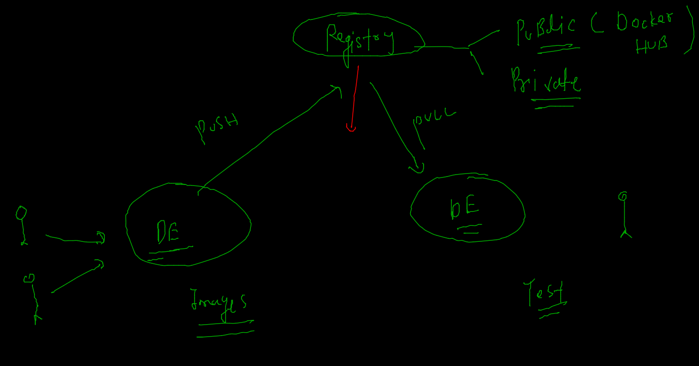

# Training Plan 


## Revision 


### Namespaces and cgroups 


### apply cgroups for RAM and CPU consumption 

```
1005  docker  run -itd --name ashuc2 --memory 100m alpine ping fb.com 
 1006  history 
 1007  docker stats
 1008  hisor
 1009  history 
 1010  docker  run -itd --name ashu23 --cpu-shares=30  --memory 100m alpine ping fb.com 
 
```

### DOcker registry 



### Docker hub registry 


## image pushing to docker hub from docker host 

### tag image as per docker hub standard 

```
docker tag  a0f1dd29f90b  docker.io/dockerashu/oracleindia:dec72021 
=== OR 
docker tag  ashualp:pycodev1  docker.io/dockerashu/oracleindia:dec72021 

```

### login to docker hub account from Docker host 

```
 docker  login 
Login with your Docker ID to push and pull images from Docker Hub. If you don't have a Docker ID, head over to https://hub.docker.com to create one.
Username: dockerashu
Password: 
WARNING! Your password will be stored unencrypted in /home/test/.docker/config.json.
Configure a credential helper to remove this warning. See
https://docs.docker.com/engine/reference/commandline/login/#credentials-store

Login Succeeded

```

### pushing image to hub 

```
docker push dockerashu/oracleindia:dec72021
The push refers to repository [docker.io/dockerashu/oracleindia]
1cbfa46102dd: Pushed 
b29741d18a4a: Pushed 
2898e0f03f21: Pushed 
8d3ac3489996: Mounted from sunilsaini/oracleindia

```

### docker logout 

```
 docker logout 
Removing login credentials for https://index.docker.io/v1/

```

### Java code based dockerfile 

```
FROM openjdk
#  predefine jdk image from docker HUB 
LABEL email="ashutoshh@linux.com"
RUN mkdir /code 
COPY hello.java /code/ 
WORKDIR /code 
# to change directory during image build time only 
RUN javac hello.java
# compling 
CMD ["java","myclass"]
# default parent process for java 

```

### Image building ..

```
docker build -t  dockerashu/oracleindia:javacode . 
Sending build context to Docker daemon  3.072kB
Step 1/7 : FROM openjdk
 ---> 1b3756d6df61
Step 2/7 : LABEL email="ashutoshh@linux.com"
 ---> Running in fa979a0c1da5
Removing intermediate container fa979a0c1da5
 ---> cd10e7d0f2ce
Step 3/7 : RUN mkdir /code
 ---> Running in 5fb038244b3f
Removing intermediate container 5fb038244b3f
 ---> 09b367d07bae
Step 4/7 : COPY hello.java /code/
 ---> b1a5424c4a54
Step 5/7 : WORKDIR /code
 ---> Running in a69eb185089b
Removing intermediate container a69eb185089b
 ---> 8c8f65f5e8d4
Step 6/7 : RUN javac hello.java
 ---> Running in 9923e7891e10
Removing intermediate container 9923e7891e10
 ---> dc673cc771e5
Step 7/7 : CMD ["java","myclass"]
 ---> Running in 04909995445a
Removing intermediate container 04909995445a
 ---> d27c17f0f9dd
Successfully built d27c17f0f9dd
Successfully tagged dockerashu/oracleindia:javacode

```

### creating container 

```
docker  run -itd --name ashujc1 --memory 200m --restart always dockerashu/oracleindia:javacode

```

### checking jdk version inside container image 

```
 docker  exec -it  ashujc1  bash 
bash-4.4# 
bash-4.4# 
bash-4.4# cat  /etc/os-release 
NAME="Oracle Linux Server"
VERSION="8.5"
ID="ol"
ID_LIKE="fedora"
VARIANT="Server"
VARIANT_ID="server"
VERSION_ID="8.5"
PLATFORM_ID="platform:el8"
PRETTY_NAME="Oracle Linux Server 8.5"
ANSI_COLOR="0;31"
CPE_NAME="cpe:/o:oracle:linux:8:5:server"
HOME_URL="https://linux.oracle.com/"
BUG_REPORT_URL="https://bugzilla.oracle.com/"

ORACLE_BUGZILLA_PRODUCT="Oracle Linux 8"
ORACLE_BUGZILLA_PRODUCT_VERSION=8.5
ORACLE_SUPPORT_PRODUCT="Oracle Linux"
ORACLE_SUPPORT_PRODUCT_VERSION=8.5
bash-4.4# java -version 
openjdk version "17.0.1" 2021-10-19
OpenJDK Runtime Environment (build 17.0.1+12-39)
OpenJDK 64-Bit Server VM (build 17.0.1+12-39, mixed mode, sharing)
bash-4.4# 

```


