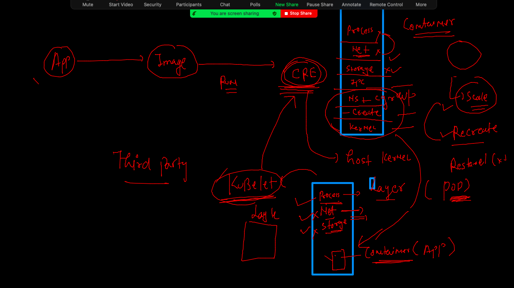

# Training Plan 


## Docker CE components 


### Docker clients 


### Portainer 

```
docker  run  -d --name webui -p 9000:9000 --restart always  --memory 500M --cpu-shares=30       -v  /var/run/docker.sock:/var/run/docker.sock  portainer/portainer 
Unable to find image 'portainer/portainer:latest' locally
latest: Pulling from portainer/portainer
94cfa856b2b1: Pull complete 
49d59ee0881a: Pull complete 
a2300fd28637: Pull complete 
Digest: sha256:fb45b43738646048a0a0cc74fcee2865b69efde857e710126084ee5de9be0f3f
Status: Downloaded newer image for portainer/portainer:latest
0b6b355dcaa8ea041d6aa3f8565e216f60541e8ab3631e55b5cd27bd2c7a6279
[test@ip-172-31-93-168 ashu_images]$ 
[test@ip-172-31-93-168 ashu_images]$ docker ps
CONTAINER ID   IMAGE                 COMMAND        CREATED         STATUS         PORTS                                       NAMES
0b6b355dcaa8   portainer/portainer   "/portainer"   5 seconds ago   Up 3 seconds   0.0.0.0:9000->9000/tcp, :::9000->9000/tcp   webui

```

### creating database container with mysql docker image 

```
 docker run -d --name mydb1 -v  ashuvol111:/var/lib/mysql/ -e MYSQL_ROOT_PASSWORD=Oracle088#  mysql 
```

### login to db 

```
 docker  exec -it mydb1  bash 
root@ed59fa947828:/# mysql -u root -p 
Enter password: 
Welcome to the MySQL monitor.  Commands end with ; or \g.
Your MySQL connection id is 8
Server version: 8.0.27 MySQL Community Server - GPL

Copyright (c) 2000, 2021, Oracle and/or its affiliates.

Oracle is a registered trademark of Oracle Corporation and/or its
affiliates. Other names may be trademarks of their respective
owners.

Type 'help;' or '\h' for help. Type '\c' to clear the current input statement.

mysql> ^DBye

```

### volume space from Engine 

```
docker  volume inspect  ashuvol111
[
    {
        "CreatedAt": "2021-12-08T05:52:55Z",
        "Driver": "local",
        "Labels": {},
        "Mountpoint": "/var/lib/docker/volumes/ashuvol111/_data",
        "Name": "ashuvol111",
        "Options": {},
        "Scope": "local"
    }
]

```

### sharing any host path as volume in container 

```
1021  docker  run -itd --name pytest1 -v  /home/test/ashu_images/pythondemo:/data:ro  python            python  /data/team.py  
 1022  docker  ps
 1023  docker logs -f pytest1
 1024  docker  restart pytest1
 1025  docker logs -f pytest1
 
```

### readonly data check 

```
docker  exec -it pytest1 bash 
root@42bc95a51e57:/# cd /data/
root@42bc95a51e57:/data# ls
Dockerfile  alpine.dockerfile  oracle.py  team.py
root@42bc95a51e57:/data# rm  oracle.py 
rm: cannot remove 'oracle.py': Read-only file system
root@42bc95a51e57:/data# exit
exit

```

## COmpose by Docker 


### Installation Link 

[Link](https://docs.docker.com/compose/install/)

### Checking 

```

[test@ip-172-31-93-168 pythondemo]$ docker-compose -v
docker-compose version 1.29.2, build 5becea4c
[test@ip-172-31-93-168 pythondemo]$ docker-compose version 
docker-compose version 1.29.2, build 5becea4c
docker-py version: 5.0.0
CPython version: 3.7.10
OpenSSL version: OpenSSL 1.1.0l  10 Sep 2019
[test@ip-172-31-93-168 pythondemo]$ 

```

### Compose file info


### RUnning first compose file


### compose commands 

```
 1006  docker-compose up  -d
 1007  docker-compose  ps
 1008  docker network  ls
 1009  docker-compose  ps
 1010  docker-compose  logs
 1011  docker-compose ps
 1012  docker-compose stop
 1013  history 
[test@ip-172-31-93-168 ashutoshhcompose]$ docker-compose  rm 
Going to remove ashuc1
Are you sure? [yN] y
Removing ashuc1 ... done
[test@ip-172-31-93-168 ashutoshhcompose]$ docker-compose  ps
Name   Command   State   Ports
------------------------------
[test@ip-172-31-93-168 ashutoshhcompose]$ docker-compose  images
Container   Repository   Tag   Image Id   Size
----------------------------------------------
[test@ip-172-31-93-168 ashutoshhcompose]$ docker-compose  up -d
Creating ashuc1 ... done
[test@ip-172-31-93-168 ashutoshhcompose]$ docker-compose  ps
 Name      Command     State   Ports
------------------------------------
ashuc1   ping fb.com   Up           
[test@ip-172-31-93-168 ashutoshhcompose]$ 

```

### compose data cleanup 

```
docker-compose down 
Stopping ashuc1 ... done
Removing ashuc1 ... done
Removing network ashutoshhcompose_default
[test@ip-172-31-93-168 ashutoshhcompose]$ 

```

### COmpose example 2 

```
version: '3.8'
services: # is about containers info in form of applicaiton 
 ashuapp2:  # first app 
  image: nginx 
  container_name: ashuc2 # optional part 
  ports:
  - "1122:80"
  restart: always 
 ashuapp1: # app1 second 
  image: alpine
  container_name: ashuc1 
  command: ping fb.com 
  restart: always 
  
  
```

### deploy 

```
$ ls
ashutoshhcompose  javacode  project-website-template  pythondemo
[test@ip-172-31-93-168 ashu_images]$ cd ashutoshhcompose/
[test@ip-172-31-93-168 ashutoshhcompose]$ ls
docker-compose.yaml  multiapp.yaml
[test@ip-172-31-93-168 ashutoshhcompose]$ docker-compose  -f multiapp.yaml  up -d
Creating network "ashutoshhcompose_default" with the default driver
Pulling ashuapp2 (nginx:)...
latest: Pulling from library/nginx
e5ae68f74026: Pull complete
21e0df283cd6: Pull complete
ed835de16acd: Pull complete
881ff011f1c9: Pull complete
77700c52c969: Pull complete
44be98c0fab6: Pull complete
Digest: sha256:9522864dd661dcadfd9958f9e0de192a1fdda2c162a35668ab6ac42b465f0603
Status: Downloaded newer image for nginx:latest
Creating ashuc1 ... done
Creating ashuc2 ... done
[test@ip-172-31-93-168 ashutoshhcompose]$ docker-compose  -f multiapp.yaml  ps
 Name               Command               State                  Ports                
--------------------------------------------------------------------------------------
ashuc1   ping fb.com                      Up                                          
ashuc2   /docker-entrypoint.sh ngin ...   Up      0.0.0.0:1122->80/tcp,:::1122->80/tcp

```

### COmpsoe docker docs 

[Docker COmpose](https://docs.docker.com/compose/)

### compsoe for tomcat webapp 

```

git clone https://github.com/redashu/javawebapp.git
Cloning into 'javawebapp'...
remote: Enumerating objects: 71, done.
remote: Counting objects: 100% (71/71), done.
remote: Compressing objects: 100% (67/67), done.
remote: Total 71 (delta 31), reused 5 (delta 0), pack-reused 0
Receiving objects: 100% (71/71), 50.95 KiB | 3.00 MiB/s, done.
Resolving deltas: 100% (31/31), done.
[test@ip-172-31-93-168 ashutoshhcompose]$ ls
docker-compose.yaml  javawebapp  multiapp.yaml
[test@ip-172-31-93-168 ashutoshhcompose]$ 

```

```
version: '3.8'
services:
 ashujavaap:
  image: dockerashu/oraclejava:webappv1 
  build:  # will build image using above name 
   context: ./javawebapp # location of dockerfile
   dockerfile: Dockerfile # under above location name of dockerfile 
  container_name: ashujava1 
  ports:
  - "8877:8080"
  restart: always 
  
 ```
  
 ### compose up 
 
 ```
  ls
docker-compose.yaml  javawebapp  multiapp.yaml  tomcat.yaml
[test@ip-172-31-93-168 ashutoshhcompose]$ docker-compose -f tomcat.yaml up -d
Creating network "ashutoshhcompose_default" with the default driver
Building ashujavaap
Sending build context to Docker daemon  156.7kB
Step 1/6 : FROM tomcat
latest: Pulling from library/tomcat
5e0b432e8ba9: Already exists 
a84cfd68b5ce: Already exists 
e8b8f2315954: Already exists 
0598fa43a7e7: Already exists 
e0d35e3be804: Already exists 
8fc448a0c88b: Already exists 
dbdff6e5955b: Pull complete 
5daf3771e3d8: Pull complete 
b7111881cc7c: Pull complete 
0721390e30ba: Pull complete 
Digest: sha256:2fa718d2e1651e9fb75e187978ac5ee0fe937f19ee92968154fae4f00a9763ff
Status: Downloaded newer image for tomcat:latest
 ---> 49842ef82091
Step 2/6 : WORKDIR /usr/local/tomcat/webapps
 ---> Running in 01355076cdf4
Removing intermediate container 01355076cdf4
 ---> e45a6d1b3cf6
Step 3/6 : RUN mkdir oracle
 ---> Running in 52d3ae59209f
Removing intermediate container 52d3ae59209f
 ---> dccb65fc1181
Step 4/6 : WORKDIR oracle
 ---> Running in ce3d9369eb56
Removing intermediate container ce3d9369eb56
 ---> af8e631c74c2
Step 5/6 : ADD myapp .
 ---> f990fa85346c
Step 6/6 : EXPOSE 8080
 ---> Running in 6b1f56cacfab
Removing intermediate container 6b1f56cacfab
 ---> e62d6965851d
Successfully built e62d6965851d
Successfully tagged dockerashu/oraclejava:webappv1
WARNING: Image for service ashujavaap was built because it did not already exist. To rebuild this image you must use `docker-compose build` or `docker-compose up --build`.
Creating ashujava1 ... done

```

### compsoe final 

```
version: '3.8'

networks: # to create network 
 ashubr1: # name of bridge 
volumes: # to create docker volume 
 ashuvolx1: # name of volume 

services:
 ashujavaap:
  image: dockerashu/oraclejava:webappv1 
  build:  # will build image using above name 
   context: ./javawebapp # location of dockerfile
   dockerfile: Dockerfile # under above location name of dockerfile 
  container_name: ashujava1 
  ports:
  - "8877:8080"
  restart: always 
  networks:
  - ashubr1
 ashudbapp: # Db container 
  image: mysql
  container_name: ashudbc1 
  volumes:
  - "ashuvolx1:/var/lib/mysql/"
  environment:
   MYSQL_ROOT_PASSWORD: "Oracledb088"
  restart: always 
  networks:
  - ashubr1
  
 ```
 
 ###
 
 ```
  docker-compose -f tomcat.yaml up -d  --build 
Creating network "ashutoshhcompose_ashubr1" with the default driver
Building ashujavaap
Sending build context to Docker daemon  156.7kB
Step 1/6 : FROM tomcat
 ---> 49842ef82091
Step 2/6 : WORKDIR /usr/local/tomcat/webapps
 ---> Using cache
 ---> e45a6d1b3cf6
Step 3/6 : RUN mkdir oracle
 ---> Using cache
 
 
 ```
 
### container / docker engine  problem statemnet 


## SOlution to container deploy replated problems 


### k8s architecture planning 


### K8s Understanding part 1  


### master node - kube-apiserver 


### Location of auth token file in cluster side 

```
 cd /etc/kubernetes/
[root@control-plane kubernetes]# ls
admin.conf 

```

### from k8s client connecting to cluster 

```
kubectl  cluster-info   --kubeconfig  admin.conf.txt 
Kubernetes control plane is running at https://35.169.179.204:6443

To further debug and diagnose cluster problems, use 'kubectl cluster-info dump'.
 fire@ashutoshhs-MacBook-Air  ~/Desktop  
 fire@ashutoshhs-MacBook-Air  ~/Desktop  
 fire@ashutoshhs-MacBook-Air  ~/Desktop  kubectl get  nodes   --kubeconfig  admin.conf.txt 
NAME            STATUS     ROLES                  AGE     VERSION
control-plane   Ready      control-plane,master   7d14h   v1.22.4
node1           NotReady   <none>                 7d14h   v1.22.4
node2           Ready      <none>                 7d14h   v1.22.4

```

### COpy kubeconfig file to location 

```
cp  admin.conf.txt  ~/.kube/config 
 fire@ashutoshhs-MacBook-Air  ~/Desktop  
 fire@ashutoshhs-MacBook-Air  ~/Desktop  kubectl  get  nodes
NAME            STATUS     ROLES                  AGE     VERSION
control-plane   Ready      control-plane,master   7d14h   v1.22.4
node1           NotReady   <none>                 7d14h   v1.22.4
node2           Ready      <none>                 7d14h   v1.22.4


```

### ETcd as brain of k8s cluster 


### more detail info 

```
kubectl get nodes -o wide
NAME            STATUS     ROLES                  AGE     VERSION   INTERNAL-IP     EXTERNAL-IP   OS-IMAGE         KERNEL-VERSION                  CONTAINER-RUNTIME
control-plane   Ready      control-plane,master   7d14h   v1.22.4   172.31.66.83    <none>        Amazon Linux 2   4.14.252-195.483.amzn2.x86_64   docker://20.10.7
node1           NotReady   <none>                 7d14h   v1.22.4   172.31.74.154   <none>        Amazon Linux 2   4.14.252-195.483.amzn2.x86_64   docker://20.10.7
node2           Ready      <none>                 7d14h   v1.22.4   172.31.66.124   <none>        Amazon Linux 2   4.14.252-195.483.amzn2.x86_64   docker://20.10.7


```

### k8s app deployment 


### k8s app deploy and Intro to POD 




